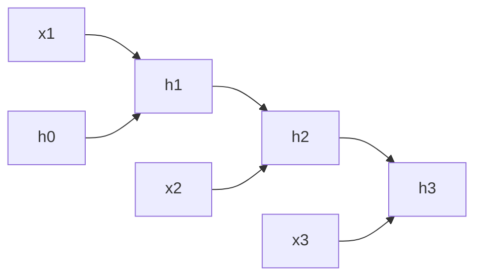
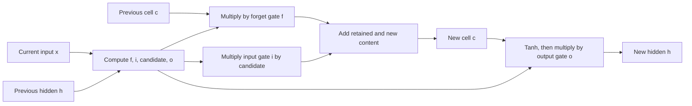

# Appendix: LSTM from scratch — memory, gates, and gradients

This optional appendix is linked from [Part 1: Embeddings](part_01_embeddings.md). A recurrent model gives us a concrete answer to “how can a model remember earlier tokens?” Seeing its strengths and limits makes the Transformer design easier to understand. You can follow the main Transformer path without completing this appendix.

**Prerequisites:** token IDs and embedding lookup from this chapter and the foundation notes. After this chapter, you should be able to calculate an LSTM step by hand, trace its tensor shapes, and explain why its cell state helps learning across time.

**Foundation connection:** [matrix shapes](module_01_foundations.md#foundation-linear-algebra) make the gate dimensions readable; [the chain rule](module_01_foundations.md#foundation-backprop) explains the repeated-gradient problem. The numerical cell example below lets you see what the gates control.

## 1. The basic recurrent idea

Suppose we have token embeddings $x_1,x_2,x_3$. A simple recurrent neural network (RNN) updates a hidden state after each token:

$$
h_t=\tanh(W_xx_t+W_hh_{t-1}+b).
$$

$x_t$ is the new input, $h_{t-1}$ is the summary so far, and $h_t$ is the updated summary. The **same** matrices $W_x$ and $W_h$ are reused at every time step; they are not separate parameters for each word. A language model can project $h_t$ to vocabulary logits and predict token $t+1$.



This diagram is the RNN **unrolled through time**. Computing $h_3$ requires $h_2$, which requires $h_1$, so time steps cannot all be computed independently.

### What a language model predicts at each step

Suppose token IDs for `the cat sat` are $(7,12,19)$. At step 1 the embedding for `the` becomes $x_1$; the model computes $h_1$ and predicts a distribution for the next ID, including `cat`. At step 2 it reads the embedding for `cat`, combines it with $h_1$, and predicts `sat`. The model does **not** wait until the end of the sentence to calculate its only loss. It can train on every next-token target in the sequence, using the true earlier tokens during teacher forcing.

The recurrence determines **how earlier input can influence a later prediction**: information must travel through the state updates. The same state-update weights are shared across steps, whether the sentence has three tokens or thirty.

## 2. Why an ordinary RNN forgets

To learn from an error at a late time step, backpropagation must carry a gradient through the earlier recurrent updates. In the scalar simplification $h_t=\tanh(wh_{t-1}+ux_t)$,

$$
\frac{\partial h_t}{\partial h_{t-k}}
=\prod_{j=t-k+1}^{t}w\bigl(1-h_j^2\bigr).
$$

If the factors are usually smaller than 1 in magnitude, this product shrinks as $k$ grows: a distant token receives little learning signal. If factors are repeatedly too large, gradients can grow. Real vector RNNs use Jacobian matrices rather than scalars, but the repeated-product problem remains. This is the vanishing/exploding gradient motivation for LSTMs, described in the [original LSTM paper](https://direct.mit.edu/neco/article/9/8/1735/6109/Long-Short-Term-Memory).

## 3. Two states instead of one

An LSTM carries a **cell state** $c_t$ for memory and a **hidden state** $h_t$ exposed to the next layer or prediction head. Each is a vector, typically of width $d_h$. Three gates choose how much memory to keep, write, and reveal. A gate is a vector with entries between 0 and 1, obtained with the sigmoid function:

$$
\sigma(z)=\frac{1}{1+e^{-z}}.
$$

For each feature, a gate near 0 suppresses a path and a gate near 1 passes most of it. These are learned, soft decisions, not literal switches.

| Symbol | Name | Question it answers |
| --- | --- | --- |
| $f_t$ | Forget gate | How much of old memory $c_{t-1}$ should remain? |
| $i_t$ | Input gate | How much candidate information should be written? |
| $\tilde c_t$ | Candidate | What new content could be written? |
| $o_t$ | Output gate | How much of the updated memory should be exposed? |

The commonly taught forget-gate LSTM is a later refinement of the 1997 architecture; the [forget-gate work](https://pubmed.ncbi.nlm.nih.gov/11032042/) explains that addition.

<figure>
  
  <figcaption>A standard modern LSTM cell diagram by Guillaume Chevalier, redrawn by Ketograff, <a href="https://commons.wikimedia.org/wiki/File:LSTM_cell.svg">Wikimedia Commons</a>, licensed <a href="https://creativecommons.org/licenses/by/4.0/">CC BY 4.0</a>. The upper path is the cell state; sigmoid boxes form gates; multiplication nodes apply gates; the addition node combines retained and candidate memory.</figcaption>
</figure>

The cell state is not a second copy of the last token. It is a learned vector that the model can carry forward with relatively direct addition and multiplication. The hidden state is a filtered view of that memory. Both go to the **next** time step; only the hidden state usually goes to the output prediction head.

## 4. The full update, one line at a time

Concatenate the current embedding and previous hidden state as $z_t=[x_t;h_{t-1}]$. With learned matrices and biases:

$$
f_t=\sigma(W_fz_t+b_f),\qquad
i_t=\sigma(W_iz_t+b_i),
$$

$$
\tilde c_t=\tanh(W_cz_t+b_c),\qquad
o_t=\sigma(W_oz_t+b_o),
$$

$$
c_t=f_t\odot c_{t-1}+i_t\odot\tilde c_t,
\qquad
h_t=o_t\odot\tanh(c_t).
$$

$\odot$ means element-by-element multiplication. If $c_t$ has width 4, all four gate and candidate vectors also have width 4. The first term retains old memory; the second writes selected new content. The output gate controls what the rest of the network sees without directly erasing the cell state.



### Where the matrix dimensions come from

If each input embedding has width $d_x$ and each hidden/cell state has width $d_h$, then $z_t=[x_t;h_{t-1}]$ has width $d_x+d_h$. Each gate matrix $W_f,W_i,W_c,W_o$ has shape $(d_h,d_x+d_h)$; each bias has length $d_h$. Every gate output, $c_t$, and $h_t$ has width $d_h$.

For example, with $d_x=3$ and $d_h=2$, the concatenated vector has five entries and each gate matrix has shape $(2,5)$. One LSTM layer therefore has $4d_h(d_x+d_h+1)=4(2)(3+2+1)=48$ gate parameters, counting biases. The embedding table and vocabulary output projection are additional parameters. Different software libraries may store the four gate matrices as one larger matrix, but the calculation is equivalent.

### See one gate's number emerge

In the scalar case, $z_t=[x_t,h_{t-1}]$. If $x_t=1$, $h_{t-1}=0$, $W_f=[0.7,0.1]$, and $b_f=0.2$, then the forget-gate logit is $0.7(1)+0.1(0)+0.2=0.9$. The gate value is $f_t=\sigma(0.9)\approx0.711$. A sigmoid turns an unrestricted logit into a smooth value between 0 and 1; the network learns the weights and bias that produce it.

## 5. Work through two time steps

Use a single memory feature so every quantity is a number. Begin with $c_0=0.5$. Imagine the learned gates produce:

| Step | $f_t$ | $i_t$ | $\tilde c_t$ | $o_t$ | Calculation |
| --- | ---: | ---: | ---: | ---: | --- |
| 1 | 0.8 | 0.6 | 0.5 | 0.5 | $c_1=0.8(0.5)+0.6(0.5)=0.70$ |
| 2 | 0.9 | 0.1 | -0.2 | 0.5 | $c_2=0.9(0.70)+0.1(-0.2)=0.61$ |

The exposed states are $h_1=0.5\tanh(0.70)\approx0.302$ and $h_2=0.5\tanh(0.61)\approx0.272$. At step 2, most previous memory survives because $f_2=0.9$; little new candidate content enters because $i_2=0.1$. These numbers illustrate the arithmetic, not a trained model's interpretable thoughts.

<iframe src="../assets/lab_lstm.html" title="Interactive LSTM memory gates lab" loading="lazy" style="width:100%;height:620px;border:0;border-radius:12px"></iframe>

[Open the LSTM lab on its own page](assets/lab_lstm.html) if you want more room for the controls.

Set $f=1$ and $i=0$ to carry the old cell unchanged. Then set $o=0$: the hidden output disappears while the cell remains. This is the arithmetic reason to keep $c_t$ and $h_t$ distinct.

```python
import numpy as np

c = 0.5
for forget, write, candidate, reveal in [(0.8, 0.6, 0.5, 0.5), (0.9, 0.1, -0.2, 0.5)]:
    c = forget * c + write * candidate
    h = reveal * np.tanh(c)
    print(f"cell={c:.3f}, hidden={h:.3f}")
```

The table deliberately **starts with gate values** so the memory arithmetic is visible. The next example calculates those values from input, previous hidden state, weights, and biases. It is a complete one-feature LSTM forward pass, with fixed demonstration weights rather than trained weights:

```python
import numpy as np

def sigmoid(z):
    return 1.0 / (1.0 + np.exp(-z))

# Rows compute forget, input, candidate, and output logits.
# Columns multiply the current input x and previous hidden h.
W = np.array([
    [ 0.7,  0.1],
    [ 0.5, -0.3],
    [ 0.6,  0.2],
    [-0.2,  0.4],
])
b = np.array([0.2, 0.0, 0.0, 0.1])

h, c = 0.0, 0.0
for x in (1.0, -1.0):
    z = np.array([x, h])
    logits = W @ z + b
    f = sigmoid(logits[0])
    i = sigmoid(logits[1])
    candidate = np.tanh(logits[2])
    o = sigmoid(logits[3])
    c = f * c + i * candidate
    h = o * np.tanh(c)
    print(f"x={x:+.1f} f={f:.3f} i={i:.3f} candidate={candidate:.3f} "
          f"o={o:.3f} c={c:.3f} h={h:.3f}")
```

The output is approximately `c=0.334, h=0.153` after $x=1$ and `c=-0.061, h=-0.036` after $x=-1$. The second input changes all four gate calculations. The cell state changes sign because retained old content and the new negative candidate are added. The numbers demonstrate the algorithm; the one-feature input does not stand for a real word embedding.

## 6. Why the cell helps gradients

Consider only the **direct memory path** from $c_{t-1}$ to $c_t$, holding the gate values fixed. Its derivative is $\partial c_t/\partial c_{t-1}=f_t$. Across two steps in the example the direct-path factor is $0.8\times0.9=0.72$. When forget gates stay near 1, this path can preserve information and gradient much better than a path repeatedly multiplied by a saturating $\tanh$ derivative. The **full** derivative also has terms because the gates depend on previous hidden state; $0.72$ is only the direct path.

LSTMs improve long-range learning, but they do not guarantee perfect memory. Capacity is finite, gate values are learned from data, and every new time step still depends on the previous step.

### A language example, with the right caveat

Consider `The keys to the old cabinet ... are missing.` A model predicting `are` can benefit from retaining information about plural `keys` while reading the intervening words. An LSTM *could* use some cell features to preserve information useful for agreement: a large forget gate would retain those features; an input gate could write new clues; an output gate could expose them when needed. This is an illustration of what the equations permit. We cannot assume an actual trained feature literally means “plural” without examining that model.

### Backpropagation through time in training

For a sequence of length $T$, unroll the same cell $T$ times, compute next-token losses $L_1,\dots,L_T$, and sum or average them. Backpropagation follows the unrolled graph backward, so the gradient for a shared gate matrix includes contributions from **every** time step at which it was used. The direct cell path helps some distant signals survive, but the computation still stores or reconstructs intermediate states for gradients. For very long streams, training often uses **truncated backpropagation through time**: divide the stream into chunks and detach the carried state at chunk boundaries. That limits how far a gradient can travel even while the forward state continues.

If the output head has matrix $W_y\in\mathbb R^{V\times d_h}$, each step produces vocabulary logits $\ell_t=W_yh_t+b_y$ of length $V$. Softmax and cross-entropy compare those logits with the true next-token ID. This completes the path from embeddings to an LSTM language-model loss.

## 7. From LSTM to attention and Transformer

In a plain sequence-to-sequence encoder-decoder, the source can be squeezed into a fixed-size final state. [Encoder-decoder attention](https://arxiv.org/abs/1409.0473) lets each decoding step inspect the encoder's **sequence of states**, easing that bottleneck. The [Transformer](https://papers.neurips.cc/paper/7181-attention-is-all-you-need.pdf) then replaces recurrent sequence processing with attention-based layers and explicitly supplies position information.

That history matters: “LSTM” and “attention” are not opposing names for the same operation. The LSTM updates memory step by step; attention computes input-dependent weights over available positions. Attention can also be added to an LSTM decoder, as it was before Transformers.

| Mechanism | Where earlier information lives | Can sequence steps run simultaneously? | What is directly revisited? |
| --- | --- | --- | --- |
| Plain RNN | Hidden state | No | Previous state |
| LSTM | Cell and hidden states | No | Previous states, with gated memory |
| Encoder-decoder LSTM with attention | Recurrent states plus saved encoder outputs | Recurrence remains sequential | Source positions through attention |
| Transformer self-attention | Token representations in the current layer | Training positions can be processed in parallel | Permitted token positions |

This table describes the **core computation**. Autoregressive generation still produces one new token at a time for a Transformer language model.

## 8. Check your understanding

1. If $f_t=1$ and $i_t=0$, what happens to $c_t$? It equals $c_{t-1}$, before considering later steps.
2. If $o_t=0$, is $c_t$ erased? No. The exposed $h_t$ is suppressed, while the cell state can still carry memory.
3. Why is an LSTM's time axis sequential? Every new $c_t$ and $h_t$ needs the previous states.
4. Why can an attention-equipped LSTM decoder do better than a fixed-context decoder? It can inspect source states again at each output step.
5. With $d_x=4$ and $d_h=3$, what shape is each gate matrix? Answer: $(3,7)$; four such matrices plus four length-3 biases have $4(3)(7+1)=96$ parameters.
6. In the executable example, change only the forget-gate bias from $0.2$ to $2.0$. What changes in the first-step retained-memory term when $c_0=0$? Nothing: even a large forget gate cannot retain a zero initial cell. What might change at the second step? More of the first-step cell state survives.

Next: [positional encoding](part_02_position_encoding.md) explains how a nonrecurrent Transformer supplies order, and [attention](part_03_attention.md) explains its direct context access.

## 9. Convert the four equations into one packed matrix

Computing four separate matrix products is easy to read, but implementations usually pack them together. With batch size $B$, input width $d_x$, and hidden width $d_h$:

$$
Z_t=[X_t;H_{t-1}]\in\mathbb R^{B\times(d_x+d_h)},
$$

$$
G_t=Z_tW+b\in\mathbb R^{B\times4d_h},
$$

where $W\in\mathbb R^{(d_x+d_h)\times4d_h}$ and $b\in\mathbb R^{4d_h}$. Split the last axis of $G_t$ into four equal pieces:

$$
G_t=[g_f\mid g_i\mid g_c\mid g_o].
$$

Then apply the correct activation to each piece:

$$
f_t=\sigma(g_f),\quad i_t=\sigma(g_i),\quad
\tilde c_t=\tanh(g_c),\quad o_t=\sigma(g_o).
$$

Packing changes storage and speed, not the LSTM mathematics. Libraries use different gate orders, such as `ifgo` or `fiog`; write the chosen order beside the split. Loading weights with the wrong order silently produces a different model.

## 10. A reusable LSTM cell and sequence loop

The executable implementation is in `llm_foundations/lstm.py`. Its cell accepts batches, keeps hidden and cell state separate, and exposes a sequence loop. The essential code is:

```python
gates = np.concatenate([x, h_previous], axis=-1) @ W + b
f_logit, i_logit, candidate_logit, o_logit = np.split(
    gates, 4, axis=-1
)

f = sigmoid(f_logit)
i = sigmoid(i_logit)
candidate = np.tanh(candidate_logit)
o = sigmoid(o_logit)

c = f * c_previous + i * candidate
h = o * np.tanh(c)
```

For a batch-major input sequence $X$ with shape $(B,T,d_x)$, recurrence requires an explicit time loop:

```python
outputs = np.empty((B, T, d_h))
h = np.zeros((B, d_h))
c = np.zeros((B, d_h))

for t in range(T):
    h, c = cell(X[:, t, :], (h, c))
    outputs[:, t, :] = h
```

Run the repository version:

```python
import numpy as np

from llm_foundations.lstm import LSTMCell

rng = np.random.default_rng(4)
x = rng.normal(size=(2, 5, 3))  # batch 2, five steps, input width 3
cell = LSTMCell(d_input=3, d_hidden=4, seed=4)
hidden_sequence, (h_final, c_final) = cell.forward_sequence(x)

assert hidden_sequence.shape == (2, 5, 4)
assert h_final.shape == (2, 4)
assert c_final.shape == (2, 4)
```

`hidden_sequence[:, t]` contains the exposed state at step $t$. The returned final state is useful when continuing the same stream in another chunk. Reset the state between unrelated sequences; otherwise information leaks from one example into another.

## 11. Turn the cell into a language model

An LSTM language model needs four surrounding components:

1. an embedding table $E\in\mathbb R^{V\times d_x}$
2. the LSTM cell or stack
3. an output matrix $W_y\in\mathbb R^{d_h\times V}$ and bias $b_y$
4. shifted next-token targets

For input IDs `the cat sat`, the training pair is conceptually:

```text
input:   the  cat  sat
target:  cat  sat  <next>
```

The full forward path is

$$
X=E[\text{input IDs}],qquad
H=\operatorname{LSTM}(X),qquad
L=HW_y+b_y.
$$

$L$ has shape $(B,T,V)$. Flatten the batch and time axes to compute cross-entropy over $BT$ target IDs, or keep the axes and reduce the per-position losses afterward. Padding positions must be excluded from the reduction; otherwise the model is rewarded for predicting padding.

For generation, feed one token, keep the returned $(h,c)$, select the next token from the output distribution, and feed that token at the next step. Unlike teacher-forced training, generation receives its own earlier choices.

## 12. What backward propagation must store

To implement training without automatic differentiation, cache at each step:

$$
Z_t, f_t, i_t, \tilde c_t, o_t, c_{t-1}, c_t, h_{t-1}.
$$

Backpropagation proceeds from $t=T-1$ to $0$. The hidden and cell gradients arriving from the future are accumulated with gradients from the loss at the current step. The most important local derivatives are

$$
\frac{d\sigma(a)}{da}=\sigma(a)(1-\sigma(a)),
\qquad
\frac{d\tanh(a)}{da}=1-\tanh^2(a).
$$

Given an incoming hidden gradient $d h_t$ and cell gradient from the next step $d c_t^{future}$:

$$
d o_t=d h_t\odot\tanh(c_t),
$$

$$
d c_t=d c_t^{future}
+d h_t\odot o_t\odot\left(1-\tanh^2(c_t)\right).
$$

The cell update then branches:

$$
d f_t=d c_t\odot c_{t-1},\qquad
d c_{t-1}=d c_t\odot f_t,
$$

$$
d i_t=d c_t\odot\tilde c_t,\qquad
d\tilde c_t=d c_t\odot i_t.
$$

Multiply the gate gradients by their activation derivatives, concatenate them into $dG_t$, and accumulate

$$
dW\mathrel{+}=Z_t^\top dG_t,qquad
db\mathrel{+}=\sum_{batch}dG_t,qquad
dZ_t=dG_tW^\top.
$$

Split $dZ_t$ into the input gradient $dX_t$ and the previous hidden gradient $dH_{t-1}$. Then continue to step $t-1$ using both $dH_{t-1}$ and $dC_{t-1}$. This is backpropagation through time written directly from the forward equations.

Before trusting a hand-written backward pass, compare selected analytic gradients with finite differences:

$$
\frac{\partial L}{\partial W_{ij}}
\approx
\frac{L(W_{ij}+\epsilon)-L(W_{ij}-\epsilon)}{2\epsilon}.
$$

Use a tiny double-precision example and $\epsilon$ around $10^{-5}$. Gradient checking is slow, but it catches wrong gate order, missing future-state gradients, and incorrect activation derivatives.

## 13. From-scratch implementation milestones

1. Implement stable sigmoid, `tanh`, and one scalar cell step.
2. Replace scalars with batched vectors and assert every shape.
3. Pack the four gate matrices and confirm the packed and unpacked calculations match.
4. Add the time loop and compare it with manually repeated cell calls.
5. Add embedding lookup and a vocabulary output projection.
6. Compute shifted-token cross-entropy at every non-padding position.
7. Cache the forward intermediates and implement the reverse-time derivatives above.
8. Gradient-check a few entries of $W$, $b$, the output matrix, and an embedding row.
9. Clip the global gradient norm before updates when it exceeds a chosen threshold.
10. Overfit one tiny sequence, then separate train and validation sequences.

After these steps, you have built the complete computational path of an LSTM language model: IDs to embeddings, recurrent gates, cell and hidden states, vocabulary logits, loss, and gradients through time.
