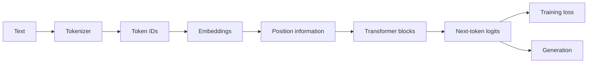

# LLM Foundations from Scratch

This is a visual, math-first study guide for understanding the internal mechanics of modern large language models.

The course starts with the [foundation chapter](module_01_foundations.md): Figure 1 from the original Transformer paper, ten ideas to track through the course, and the math of dot products, outer products, frequency, and rotation. Then follow the main path:

1. [Tokenization and embeddings](part_01_embeddings.md)
2. [Frequency, sinusoids, Euler's formula, and RoPE](part_02_position_encoding.md)
3. [Attention and multi-head attention](part_03_attention.md)
4. [The complete decoder block](part_04_transformer_block.md)
5. [Training objective and optimization](part_05_training_and_optimization.md)
6. [Generation, caching, and serving](part_06_inference_and_tricks.md)

Tokenization is treated as the front-end of the embedding chapter, not as a separate numbered chapter in this course.

The [LSTM appendix](appendix_lstm.md) is optional background, linked from the embedding chapter when recurrent sequence models enter the story.

## Why this order?

Because a transformer is built in layers of abstraction:

- first, tokens become vectors
- then the model adds positional structure
- then it routes information with attention
- then residual blocks and an MLP transform those representations
- the model learns through shifted-token loss before it generates at inference time

## The core mental model

## The mathematical spine

The important mathematical objects are:

- vectors in $\mathbb{R}^d$
- matrices for projection and mixing
- similarity functions like dot products
- softmax for attention weights
- rotation-based position encoding for relative structure

## Learning goals

By the end of this path, you should be able to explain:

- why embeddings are required
- why sequence order matters
- why sine/cosine positional encodings work
- why RoPE is useful for relative position
- why attention is a weighted retrieval mechanism
- why multi-head attention is useful
- why inference uses caching and other tricks
- why next-token prediction and teacher forcing are the core training objective
- how a tokenizer, decoder block, training loop, and generation loop fit together

## Recommended reading path

- Start with the original paper figure and math in the foundation chapter.
- Work through the tokenizer-to-embedding pipeline as the first real model step.
- Continue through positional encoding and its wave and rotation prerequisites.
- Then study attention carefully.
- Assemble the decoder block and learn the training objective.
- Finish with inference and serving.

Each chapter mixes:

- intuition
- diagrams
- formulas
- code examples
- numerical examples
