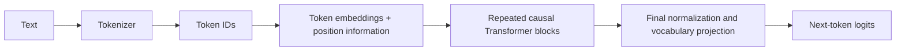
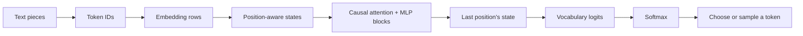
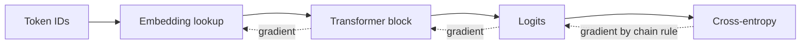
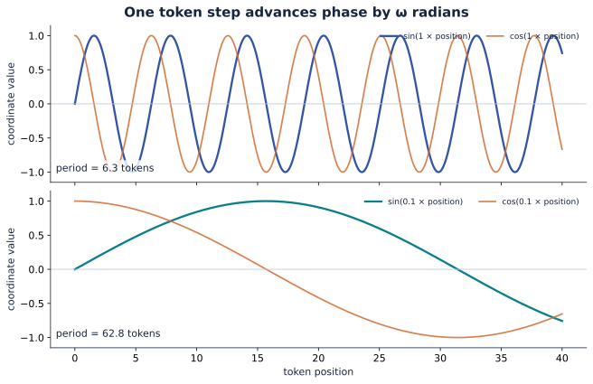
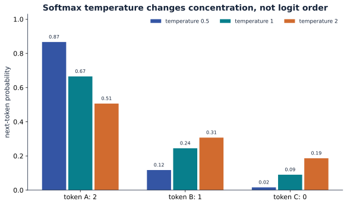
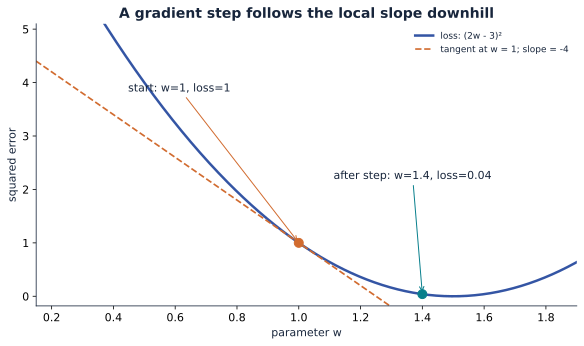

# Foundation 0: architecture, math, probability, and learning

The Transformer was introduced for sequence-to-sequence translation. Its original architecture has an **encoder on the left** and a **decoder on the right**. Many current language models use a decoder-only descendant. Keep those two designs distinct as you read the rest of this course.

## Figure 1 from the research paper

<figure>
  
  <figcaption>Figure 1, reproduced from Vaswani et al., <a href="https://papers.neurips.cc/paper/7181-attention-is-all-you-need.pdf"><em>Attention Is All You Need</em> (2017)</a>. The image is extracted from the authors' paper, not redrawn for this site.</figcaption>
</figure>

Read the diagram from bottom to top:

1. **Inputs** are source tokens. **Outputs (shifted right)** are the target tokens already available to the decoder. During training these are ground-truth target tokens; during generation they are the tokens produced so far.
2. Both sides map token IDs to vectors and add positional encodings. The 2017 paper used additive sinusoidal or learned absolute positions, not RoPE.
3. Each encoder layer has unmasked multi-head self-attention, a position-wise feed-forward network, and residual **Add & Norm** after each sublayer. The stack is repeated $N$ times.
4. Each decoder layer first uses **masked** self-attention, then attention whose queries come from the decoder and whose keys and values come from the encoder, then a feed-forward network. Each sublayer has its own residual Add & Norm.
5. A linear projection and softmax produce a distribution over output tokens. A language model trains on the next token at **every** eligible position, even though generation produces tokens one at a time.

The second attention module on the decoder side is **cross-attention**. Its arrows from the encoder output are essential: the decoder can inspect the source sentence while predicting the translation. The original paper uses *post-norm* blocks, with normalization after residual addition; many later models use *pre-norm* blocks.

## How this relates to a decoder-only language model

For a GPT-style language model, remove the encoder stack and the decoder's cross-attention sublayer. The remaining causal self-attention stack reads the prefix and predicts its continuation:



This is a **model-family change**, not a claim that Figure 1 itself depicts GPT. The encoder-only family instead keeps bidirectional self-attention and is commonly trained with objectives such as masked-token prediction. Encoder-decoder models keep both stacks and cross-attention.

### Follow one prediction from text to a token {#foundation-data-flow}

Consider the prefix `the cat sat`. A tokenizer maps its text pieces to integer IDs. If the IDs are $[4,17,9]$, they are **addresses**, not numeric measurements of meaning: ID 17 is not more meaningful than ID 4 because it is larger. A learned table $E\in\mathbb R^{V\times d}$ selects three rows, producing $X\in\mathbb R^{3\times d}$. Position information distinguishes the three locations. Causal attention lets the representation at `sat` incorporate information from `the` and `cat`; the MLP changes features within each position. Repeated blocks produce final states $H\in\mathbb R^{3\times d}$.

For the last state $h_2$, an output matrix $U\in\mathbb R^{d\times V}$ gives logits $z=h_2U+b\in\mathbb R^V$. Vocabulary softmax turns those scores into a next-token distribution. Choosing or sampling one token, appending its ID, and running another forward step generates a continuation. During training, the same causal stack produces logits at **all three positions at once**; each position predicts its own next token. [Part 1](part_01_embeddings.md#lookup-to-output) follows the two learned tables, and the [attention example](part_03_attention.md#attention-routing-example) opens the context-routing step.



Two kinds of numbers appear in this diagram. **Parameters** are the reusable table entries and projection weights learned during training. **Activations** are the vectors, scores, and probabilities computed for this particular prefix. A parameter matrix can be reused at every position; an activation changes when the input changes. The loss compares the predicted distribution with the observed next token, and backpropagation updates the parameters. This distinction helps when a diagram uses the word “vector” for both learned weights and token states.

| Family | Information available at a position | Core stack | Example objective |
| --- | --- | --- | --- |
| Encoder-only | Both left and right context | Unmasked self-attention | Masked-token prediction |
| Decoder-only | Current and earlier positions | Causal self-attention | Next-token prediction |
| Encoder-decoder | Full source plus earlier target positions | Encoder, masked decoder, cross-attention | Conditional next-token prediction |

## Ten ideas to carry through this course

This is the prerequisite map. You do not need to master all ten before reading Part 0; return here when a later equation uses one.

| # | Idea | What to be able to do | Where it returns |
| ---: | --- | --- | --- |
| 1 | Tokens and IDs | Distinguish a piece of text from its integer vocabulary address | [Embeddings](part_01_embeddings.md) |
| 2 | Vectors and axes | Read a shape such as $(B,T,d)$ as batch, token position, and features | [Embeddings](part_01_embeddings.md) |
| 3 | Embedding lookup | Select one learned row with a token ID or one-hot vector | [Embeddings](part_01_embeddings.md) |
| 4 | Dot and outer products | Tell a scalar similarity from a matrix of pairwise products | [Attention](part_03_attention.md) |
| 5 | Matrix multiplication | Check inner dimensions and understand learned projections | [Decoder block](part_04_transformer_block.md) |
| 6 | Softmax and probability | Turn a row of scores into nonnegative weights summing to one | [Attention](part_03_attention.md) |
| 7 | Gradients and chain rule | Trace how a loss changes an embedding or weight | [Training](part_05_training_and_optimization.md) |
| 8 | Frequency and sinusoids | Convert radians per token to a period and read a sine/cosine pair | [Position](part_02_position_encoding.md) |
| 9 | Complex numbers and rotations | See why multiplication by $e^{i\theta}$ rotates a 2D pair | [RoPE](part_02_position_encoding.md) |
| 10 | Causality and residuals | Explain future-token masking and why a block adds its input back | [Block](part_04_transformer_block.md) and [training](part_05_training_and_optimization.md) |

The next sections work through the math behind items 2–9. The later chapters apply it to the model.

## Math bridge: shapes, dot products, and outer products {#foundation-linear-algebra}

These operations explain the arrows in Figure 1. A shape describes what an array contains; a dot product produces one score; an outer product produces a table; matrix multiplication combines many such calculations. Work through the numbers once before moving to attention.

### 1. Scalars, vectors, and matrices

A scalar is one number. A vector is an ordered list of numbers. A matrix is a rectangular table. A tensor is a general array; in this course, a tensor often has axes for batch, token position, and feature.

For a sequence of three tokens, each represented by two features, write the rows as

$$
X=\begin{bmatrix}1&2\\3&4\\5&6\end{bmatrix}
\quad\text{with shape }(T,d)=(3,2).
$$

The first row is one token's feature vector. Column 1 is one feature across all three tokens. A batch of four such sequences has shape $(B,T,d)=(4,3,2)$. The shapes tell us which axes an operation combines.

### 2. The dot product returns one number

For two length-two vectors, $a=[1,2]$ and $b=[3,4]$,

$$
a\cdot b=1(3)+2(4)=11.
$$

The dot product multiplies corresponding components and **sums** them. In attention, a query and a key each have $d_k$ components, and their dot product is one compatibility score. A large score does not prove a human-readable relationship; the learned projections determine what the score measures.

If we treat $a$ and $b$ as column vectors, the same operation is $a^\top b$: shape $(1,2)(2,1)=(1,1)$.

### 3. The outer product returns a table

With the same vectors as columns,

$$
ab^\top=
\begin{bmatrix}1\\2\end{bmatrix}
\begin{bmatrix}3&4\end{bmatrix}
=\begin{bmatrix}3&4\\6&8\end{bmatrix}.
$$

There is **no sum**. Entry $(i,j)$ is $a_i b_j$. The result has shape $(2,1)(1,2)=(2,2)$. This is the clearest way to distinguish the two products:

| Operation | Shape | Result |
| --- | --- | --- |
| $a^\top b$ | $(1,2)(2,1)$ | Scalar $11$ |
| $ab^\top$ | $(2,1)(1,2)$ | Matrix $\left[\begin{smallmatrix}3&4\\6&8\end{smallmatrix}\right]$ |

Outer products appear when we build pairwise tables or express a matrix as a sum of rank-one pieces. They are **not** the per-token query-key score: that score is a dot product.

### 4. Why attention's $QK^\top$ is a matrix

Let three query rows and three key rows each have two features:

$$
Q=\begin{bmatrix}1&0\\0&1\\1&1\end{bmatrix},\qquad
K=\begin{bmatrix}1&0\\1&1\\0&1\end{bmatrix}.
$$

Then $Q$ has shape $(3,2)$ and $K^\top$ has shape $(2,3)$. Their product has shape $(3,3)$:

$$
QK^\top=
\begin{bmatrix}1&1&0\\0&1&1\\1&2&1\end{bmatrix}.
$$

Check one entry: row 3 of $Q$ dotted with row 2 of $K$ is $[1,1]\cdot[1,1]=2$. Thus **each cell is a dot product between one query and one key**. Rows select a query position; columns select a key position.

There is also an outer-product view. If $Q_{:,r}$ means feature column $r$ of $Q$, then

$$
QK^\top=\sum_{r=1}^{d_k}Q_{:,r}K_{:,r}^\top.
$$

Each summand is an outer product across token positions. This decomposition explains how a matrix multiplication can create the complete token-by-token score table from feature columns. The two views describe the **same** computation at different levels.

### 5. Matrix multiplication as a shape contract

A matrix product $(m,n)(n,p)$ returns $(m,p)$: the inner dimensions match and are summed over. In a batched attention head:

```text
Q:       (B, H, T, D)
K^T:     (B, H, D, T)
QK^T:    (B, H, T, T)
weights: (B, H, T, T)
V:       (B, H, T, D)
output:  (B, H, T, D)
```

$B$ is batch size, $H$ is head count, $T$ is sequence length, and $D$ is head width. The last two axes are multiplied within each batch and head. A causal mask has shape $(T,T)$ and is broadcast over batch and heads.

### 6. How an embedding lookup fits the same math

An embedding table $E$ has one row per token ID: shape $(V,d)$. If token ID 2 has one-hot row $e_2=[0,0,1,0]$ and $E$ has four rows, then

$$
e_2E=E_{2,:}.
$$

The one-hot matrix product selects one row. Real implementations use an integer-index lookup instead of materializing a large one-hot vector. The lookup output is a **learned parameter vector**, not the token's ID written in binary and not the final contextual representation. Attention layers later change that vector using its context.

### 7. Check yourself

1. If $Q$ is $(5,4)$ and $K$ is $(7,4)$, what shape is $QK^\top$? Answer: $(5,7)$; cross-attention can have different query and key lengths.
2. If $a$ is length 3 and $b$ is length 2, can you take $a\cdot b$? No: their feature widths differ. What shape is $ab^\top$? $(3,2)$.
3. In a causal $4\times4$ score table, which cells of row 2 can survive the mask if positions are numbered 0–3? Columns 0, 1, and 2.

## Frequency, sinusoids, and rotation: the math before position {#foundation-frequency}

A **frequency** says how quickly a repeating signal completes a cycle. On a unit circle, one full turn is $2\pi$ radians. If a point advances by $\omega$ radians for every new token position $p$, its angle is $\theta_p=\omega p$. Here $\omega$ is **angular frequency**, measured in radians per token. The point's coordinates are $(\cos\theta_p,\sin\theta_p)$.

The **period** is the number of token steps needed for a full turn:

$$
P=\frac{2\pi}{\omega}.
$$

For $\omega=1$, the point goes around in about 6.28 token steps. For $\omega=0.1$, it takes about 62.8 steps. The first changes rapidly across nearby positions; the second changes slowly. These are coordinates for an index, not sound waves and not time measured in seconds.

| Position $p$ | Angle at $\omega=0.1$ | Coordinates $(\cos(0.1p),\sin(0.1p))$ |
| ---: | ---: | --- |
| 0 | 0 | $(1,0)$ |
| 1 | 0.1 | Approximately $(0.995,0.100)$ |
| 2 | 0.2 | Approximately $(0.980,0.199)$ |
| 3 | 0.3 | Approximately $(0.955,0.296)$ |

Sine and cosine are paired because one coordinate alone cannot tell where a point is around the circle. The pair represents **phase**, its angle within the cycle. A single pair eventually repeats; several pairs with different frequencies let the model observe short and long positional scales together. This does not guarantee unique codes at arbitrary sequence lengths.

The original Transformer uses a frequency for each feature pair:

$$
\omega_k=10000^{-2k/d},\qquad
PE(p,2k)=\sin(p\omega_k),\quad PE(p,2k+1)=\cos(p\omega_k).
$$

For width $d=8$, $\omega_k$ is $1,0.1,0.01,0.001$ for pairs $k=0,1,2,3$. **Lower-numbered pairs move faster; higher-numbered pairs move slower.** These position vectors are added to token embeddings in the original paper. [Part 2](part_02_position_encoding.md) works through the full construction and its limits.

Why do rotations appear later in RoPE? A complex number $a+ib$ is another way to write a point $(a,b)$, with $i^2=-1$. Euler's formula says $e^{i\theta}=\cos\theta+i\sin\theta$. Multiplying by $e^{i\theta}$ rotates the point by $\theta$; multiplying two such factors adds angles. RoPE uses that same geometry to rotate **queries and keys** by an angle based on their positions. Its query-key dot product then contains their relative position difference. The [position chapter](part_02_position_encoding.md) derives the matrix and dot-product identities step by step; complex data types are not required to implement them.

**Check yourself:** If $\omega$ changes from $0.1$ to $0.01$, does the period become longer or shorter? It becomes ten times longer: from about 62.8 to 628 token steps.

## Probability, gradients, and causal flow

**Softmax** converts a row of arbitrary scores to nonnegative weights that sum to 1. If the scores are $[0,\ln2]$, exponentiation gives $[1,2]$ and dividing by their sum gives $[1/3,2/3]$. In attention, this happens **across the permitted key positions for one query**. For next-token prediction, softmax instead runs across vocabulary logits. The operation is the same; the axis and meaning differ.

A **gradient** tells us how a small parameter change affects loss. In a one-parameter example with prediction $wx$, target $y$, and loss $L=(wx-y)^2$, the chain rule gives $\partial L/\partial w=2(wx-y)x$. If $w=1,x=2,y=3$, then $L=1$ and the gradient is $-4$. A gradient-descent step of size $0.1$ sets $w$ to $1-0.1(-4)=1.4$. In a Transformer, backpropagation applies the same chain-rule idea through embedding lookups, matrix products, softmax, and blocks.

**Causal masking** prevents a training position from reading future target tokens. For three positions, the allowed attention pattern is:

```text
            key 0  key 1  key 2
query 0       ✓      ×      ×
query 1       ✓      ✓      ×
query 2       ✓      ✓      ✓
```

Scores at forbidden cells are set to negative infinity before softmax, giving them zero weight. A **residual connection** then adds a sublayer's input to its output, $Y=X+F(X)$, so the block can preserve an information path while learning a change. Normalization rescales features to help optimization; [Part 4](part_04_transformer_block.md) places these operations in the complete block.

## Vector geometry: length, angle, and projection {#foundation-geometry}

The **length** of $u=[u_1,\ldots,u_d]$ is its Euclidean norm $\|u\|_2=\sqrt{\sum_i u_i^2}$. For $u=[3,4]$, it is 5. Distance $\|u-v\|_2$ measures separation between endpoints; the dot product combines lengths and the angle between vectors:

$$
u\cdot v=\|u\|_2\|v\|_2\cos\theta.
$$

Dividing by both lengths gives **cosine similarity**, $\cos\theta=(u\cdot v)/(\|u\|_2\|v\|_2)$. It compares direction without directly depending on vector magnitude. By contrast, ordinary attention uses learned query-key dot products and a $1/\sqrt{d_k}$ scale; it does not automatically normalize each query and key to unit length. The model can use both direction and magnitude. [Part 1](part_01_embeddings.md) uses cosine similarity for an embedding example, and [Part 3](part_03_attention.md) uses scaled dot products for routing.

A **projection** asks how much of $u$ lies along a direction $v$. If $\hat v=v/\|v\|_2$ is unit length, the scalar component is $u\cdot\hat v$ and the projected vector is $(u\cdot\hat v)\hat v$. Learned matrices such as $W_Q$ and $W_K$ do more than one fixed projection: their columns learn combinations of input features. They are trained to make useful query and key spaces, which is why an embedding's raw cosine similarity need not equal its attention score.

## Linear maps, rank, and SVD {#foundation-svd}

A matrix $W\in\mathbb R^{d_{out}\times d_{in}}$ maps an input feature vector $x\in\mathbb R^{d_{in}}$ to $Wx\in\mathbb R^{d_{out}}$. It can rotate, scale, mix, and collapse directions. Its **rank** is the number of independent output directions it can express. A rank-one matrix is an outer product $uv^\top$; it maps every input onto a multiple of one output direction.

Singular value decomposition writes a matrix as $X=U\Sigma V^\top$: orthogonal directions on each side with scaling values in $\Sigma$. Keeping only the largest $r$ singular values gives a rank-$r$ approximation $X_r$ that retains the strongest linear patterns under squared reconstruction error. In historical document-term methods, this gave a compressed latent space for co-occurrence counts. It is **not** the same operation as a Transformer token embedding lookup, whose rows are trainable parameters. [Part 1](part_01_embeddings.md) contrasts these representation methods.

## Probability: events, conditionals, and sequences {#foundation-probability}

A probability distribution assigns nonnegative mass summing to 1. For a vocabulary of three tokens, $[0.6,0.3,0.1]$ is valid: it says how likely each *next token* is under one fixed context. It is not a statement that the entire sentence has those probabilities.

**Conditional probability** is the probability of an event once another event is known. The product rule is $P(A,B)=P(A)P(B\mid A)$. Repeating it gives the sequence **chain rule**:

$$
P(x_1,x_2,\ldots,x_T)=\prod_{t=1}^{T}P(x_t\mid x_1,\ldots,x_{t-1}).
$$

This identity does not assume the tokens are independent. A decoder-only language model estimates each conditional using the prefix. For a toy two-token string, if $P(x_1=\text{cat})=0.2$ and $P(x_2=\text{sleeps}\mid x_1=\text{cat})=0.4$, the probability of that two-token sequence is $0.2\times0.4=0.08$. The chain rule explains both [shifted training targets](part_01_embeddings.md) and [autoregressive generation](part_06_inference_and_tricks.md).

```mermaid
flowchart LR
    C[Start] -->|P(cat) = 0.2| A[cat]
    A -->|P(sleeps given cat) = 0.4| B[cat sleeps]
    B --> J[Joint probability = 0.2 × 0.4 = 0.08]
```

At inference, a distribution does not select a token by itself. **Greedy decoding** chooses the highest-probability token. **Sampling** draws one according to its probabilities. These choices can produce different continuations from exactly the same model logits.

### Expectation, variance, and Bayes' rule

For a discrete random variable $X$ with values $x_j$ and probabilities $p_j$, its **expectation** is $\mathbb E[X]=\sum_jp_jx_j$. Its **variance** is $\mathbb E[(X-\mathbb E[X])^2]$: expected squared deviation from the mean. If $X$ is 0 or 1 with equal probability, its mean is 0.5 and variance is 0.25. These ideas recur when discussing activation scales, normalization, noisy gradient estimates, and sampling variability.

Bayes' rule follows from two ways to write a joint probability:

$$
P(A\mid B)=\frac{P(B\mid A)P(A)}{P(B)},\qquad P(B)>0.
$$

For example, if 1% of messages have a property $A$, a test catches 90% of those, and also flags 10% of messages without $A$, then $P(A\mid\text{flag})=0.9(0.01)/[0.9(0.01)+0.1(0.99)]\approx0.083$. A strong-looking test can have a low posterior when the base rate is small. A standard next-token Transformer directly models $P(\text{next token}\mid\text{prefix})$ by training; it need not explicitly evaluate Bayes' rule for every prediction. The rule is useful when reasoning about priors, evidence, and evaluation claims.

## Logits, softmax, and temperature {#foundation-softmax}

The network outputs **logits** $z_1,\ldots,z_V$: unrestricted real-valued scores, not probabilities. Softmax maps them to probabilities:

$$
p_j=\frac{e^{z_j}}{\sum_{k=1}^{V}e^{z_k}}.
$$

Adding the same constant to every logit changes no probability, because the factor cancels. This lets an implementation subtract the largest logit before exponentiation, avoiding overflow. **Temperature** divides logits by a positive number $\tau$: $p_j(\tau)=\operatorname{softmax}(z/\tau)_j$. A lower $\tau$ makes the distribution more concentrated; a higher $\tau$ makes it flatter. Temperature changes **decoding**, not what the already trained weights are. Try $z=[2,1,0]$ at $\tau=0.5,1,2$ with the [probability lab](#foundation-labs).

## Loss, information, and perplexity {#foundation-loss}

Suppose the correct next token has predicted probability $p_y$. Its **negative log-likelihood** is $-\log p_y$. A correct token assigned probability 0.8 costs about 0.223 nats; probability 0.1 costs about 2.303 nats. The logarithm turns the product of many sequence probabilities into a sum of token losses, which is easier to optimize:

$$
-\log P(x_1,\ldots,x_T)=-\sum_{t=1}^{T}\log P(x_t\mid x_{<t}).
$$

For a target distribution $q$ and prediction $p$, **cross-entropy** is $H(q,p)=-\sum_j q_j\log p_j$. A one-hot target has all its mass on the observed token, reducing the formula to $-\log p_y$. **Entropy** $H(q)=-\sum_jq_j\log q_j$ measures uncertainty in $q$ itself. **KL divergence** $D_{KL}(q\|p)=\sum_jq_j\log(q_j/p_j)=H(q,p)-H(q)$ compares distributions. These quantities answer different questions, even though all contain logarithms.

Average token cross-entropy is often reported as **perplexity**, $\exp(\text{average loss})$. If every correct token received probability $1/4$, the average loss would be $\log4$ and perplexity would be 4. Perplexity depends on the tokenizer: changing token boundaries changes the units being predicted, so values from different tokenizers are not directly comparable. [Part 5](part_05_training_and_optimization.md) applies cross-entropy to every shifted target in a batch.

## Derivatives, chain rule, and backpropagation {#foundation-backprop}

A derivative measures how a small input change affects an output. The **chain rule** combines derivatives through stages: if $a=f(w)$ and $L=g(a)$, then $dL/dw=(dL/da)(da/dw)$. Backpropagation applies this rule from the loss toward earlier operations. For vectors and matrices, the gradients have the same shapes as the parameters they update.

For a linear layer $y=Wx$, with $W\in\mathbb R^{m\times n}$ and $x\in\mathbb R^n$, suppose the upstream gradient is $g=\partial L/\partial y\in\mathbb R^m$. Then

$$
\frac{\partial L}{\partial W}=gx^\top\in\mathbb R^{m\times n},\qquad
\frac{\partial L}{\partial x}=W^\top g\in\mathbb R^n.
$$

Here the **outer product** has a second use: it forms the weight-gradient matrix for one example. This is separate from the query-key dot products used in the forward attention pass. In a batch, contributions from examples and positions are summed or averaged. The gradient continues through earlier layers and reaches the selected embedding rows. This is the core mechanism behind the [training chapter](part_05_training_and_optimization.md).

For a residual $y=x+F(x)$, the input gradient contains a direct path plus a path through $F$: $\partial L/\partial x=g+(\partial F/\partial x)^\top g$. The direct $g$ helps gradients travel through deep stacks. It does not remove the need for normalization or a sensible optimization setup.



## Learning: objective, optimizer, and validation {#foundation-learning}

The **objective** defines what success means for training: for a causal language model, increase probability on observed next tokens. The **optimizer** chooses parameter updates from gradients. Plain stochastic gradient descent uses $\theta\leftarrow\theta-\eta\nabla_\theta L$ for learning rate $\eta$. AdamW keeps running estimates of gradient size and applies decoupled weight decay; it still follows gradients of the same chosen objective. The training batch affects the gradient estimate, so updates from different batches need not be identical.

Training loss asks how well the model fits examples it is updating on. **Validation loss** measures held-out examples that do not update weights. If training loss falls while validation loss rises, overfitting is a likely explanation. If both remain high, the model, data, optimizer, or training time may be inadequate. Validation data should be separated before making overlapping sequence windows, or nearly identical windows can leak between sets. [The embedding chapter](part_01_embeddings.md) covers that data step; [Part 5](part_05_training_and_optimization.md) covers the update loop.

An optimizer step needs more than a loss value: it needs gradients, a learning rate, and a rule for using previous gradients. AdamW forms moving averages of gradients and squared gradients, corrects their initial bias, and scales each parameter's update by its estimated variation. Decoupled **weight decay** shrinks parameters separately from the loss gradient. A learning-rate schedule changes step size over training; gradient clipping limits unusually large gradient norms. None of these replaces checking that a small model can overfit one batch and that held-out loss is measured separately.

**Teacher forcing** means the model receives true earlier tokens as inputs while training and computes losses at all eligible positions in parallel under a causal mask. At inference, new inputs include its own previous outputs. This is why the [inference chapter](part_06_inference_and_tricks.md) treats generation separately from optimization.

## Numerical and compute checks {#foundation-compute}

The score matrix of full self-attention has $T^2$ entries per head for context length $T$. Doubling $T$ makes that table four times larger. This describes score-matrix size, not every hardware cost of an implementation; memory-aware kernels can avoid materializing the full matrix. The [attention](part_03_attention.md) and [inference](part_06_inference_and_tricks.md) chapters separate arithmetic, memory traffic, and sequential generation cost.

Floating-point arithmetic also shapes implementations. Subtract the largest logit before softmax; use a finite large negative mask value when a kernel's numeric type cannot represent $-\infty$ safely; ensure each softmax row has at least one allowed key. A correct formula and a stable implementation are related but distinct achievements.

### Why normalization and scaling appear

LayerNorm computes a mean and variance across features of one token, normalizes those features with a small $\epsilon$ to avoid division by zero, then applies learned scale and shift:

$$
\operatorname{LN}(x)=\gamma\odot\frac{x-\mu(x)}{\sqrt{\operatorname{Var}(x)+\epsilon}}+\beta.
$$

This is distinct from softmax: LayerNorm changes activation scales within a token; softmax turns a row of scores into a distribution. In attention, dividing $q\cdot k$ by $\sqrt{d_k}$ helps keep score magnitudes from growing with head width under a simple independent-component approximation. Neither operation is a substitute for the other. [Part 4](part_04_transformer_block.md) shows where normalization sits; [Part 3](part_03_attention.md) shows where score scaling sits.

## Visual labs and reproducible plots {#foundation-labs}

The plots below are generated from `examples/plot_foundations.py` with NumPy and Matplotlib. Run `python examples/plot_foundations.py` from the repository root to regenerate the SVG and PNG files. The HTML labs are small self-contained simulations; their controls change the equations explained above.

### Frequency at two scales



A smaller $\omega$ stretches the wave over more token positions. Continue with the [position lab and derivation](part_02_position_encoding.md).

### Temperature and token probability



<iframe src="../assets/lab_probability.html" title="Interactive softmax and loss lab" loading="lazy" style="width:100%;height:555px;border:0;border-radius:12px"></iframe>

[Open the probability lab on its own page](assets/lab_probability.html) if you want more room for the controls.

Set the target to the least likely token and observe its cross-entropy loss. Changing only the target leaves the softmax bars unchanged.

### One gradient step



The tangent slope is $-4$ at $w=1$, so a positive learning-rate step moves $w$ right and lowers this example's loss. The [training chapter](part_05_training_and_optimization.md) replaces this one-parameter demonstration with the language-model objective.

## A single decoder block, with shapes

Let $X\in\mathbb{R}^{B\times T\times d}$ be a batch of $B$ sequences, each of length $T$ and width $d$. A modern **pre-norm** decoder block can be written as:

$$
H = X + \operatorname{MHA}_{\mathrm{causal}}(\operatorname{Norm}(X)),
\qquad
Y = H + \operatorname{MLP}(\operatorname{Norm}(H)).
$$

Every term added by a residual connection has shape $B\times T\times d$. Attention mixes information **across positions**; the MLP transforms each position **independently**, using the same learned weights at each position. Repeating this block lets the model compose those operations. The [complete block chapter](part_04_transformer_block.md) derives the dimensions and parameter count.

The paper's post-norm ordering is different:

$$
H = \operatorname{Norm}(X+\operatorname{MHA}_{\mathrm{causal}}(X)),
\qquad
Y = \operatorname{Norm}(H+\operatorname{MLP}(H)).
$$

## The learning path

1. [Tokenization and embeddings](part_01_embeddings.md): turn text into IDs, select embedding rows, and construct input-target pairs.
2. [Embeddings](part_01_embeddings.md): learn what a token lookup vector is and how its row receives gradients.
3. [Position](part_02_position_encoding.md): apply frequency and rotation to Transformer positions.
4. [Attention](part_03_attention.md): derive $QK^\top$, masking, softmax, and value mixing.
5. [Transformer block](part_04_transformer_block.md): assemble attention, residuals, normalization, and the MLP.
6. [Training](part_05_training_and_optimization.md): compute shifted-token loss and update the weights.
7. [Inference](part_06_inference_and_tricks.md): generate from a trained model, then study caching and serving trade-offs.

The [LSTM appendix](appendix_lstm.md), linked again in Part 1, gives optional historical and mathematical background on recurrent memory and the sequence-to-sequence models that preceded Transformers.

**Check your understanding:** In Figure 1, trace the path from source input embedding to one target output probability. Which decoder attention module receives encoder information? Why must the other decoder attention module be masked?
