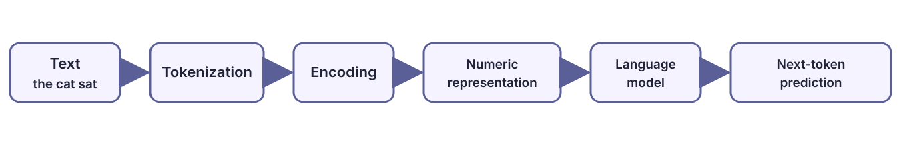
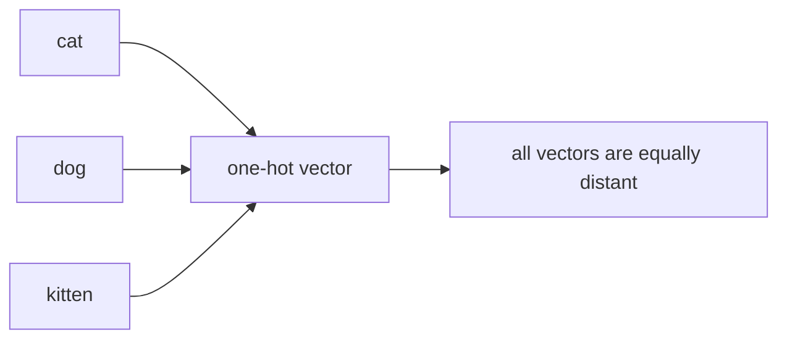
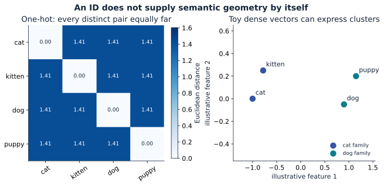
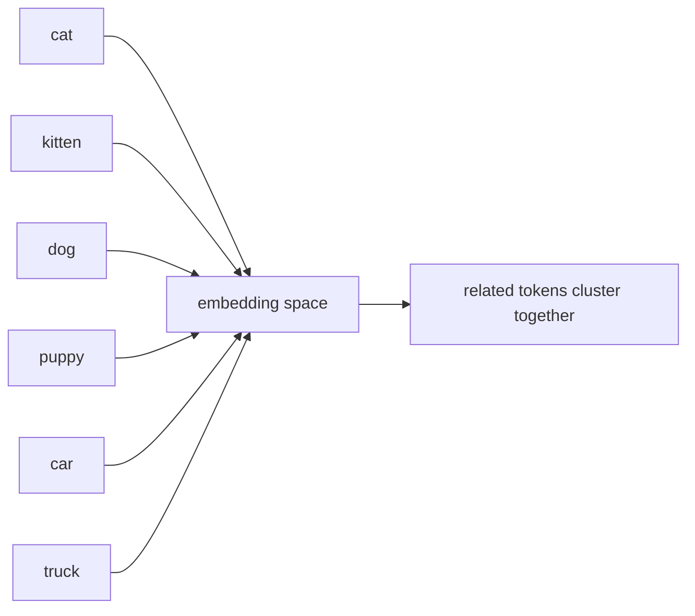
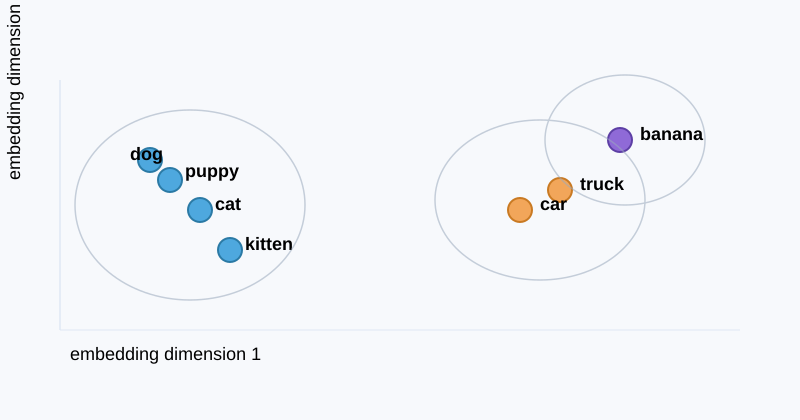
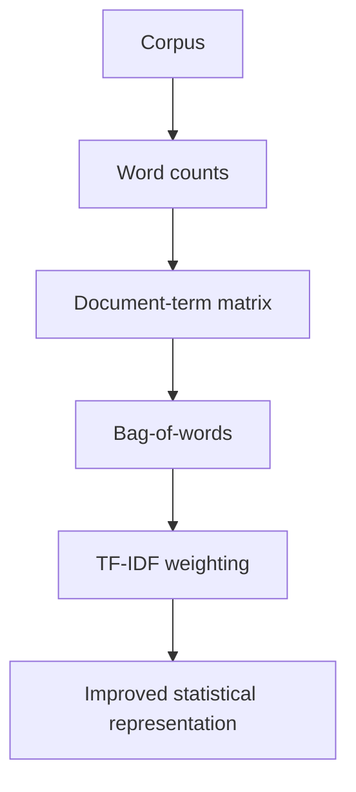
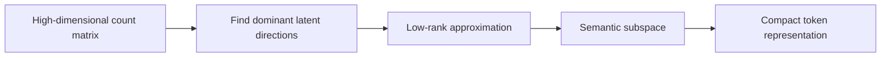
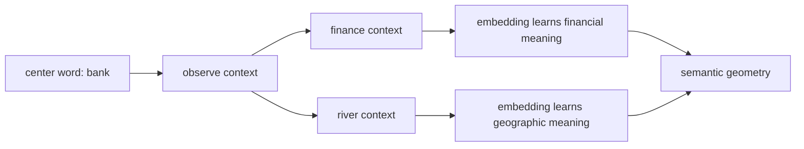

# Part 1: Tokenization and embeddings

This chapter covers the first real step in the Transformer pipeline: turning text into token IDs and then turning those IDs into learned vectors. Tokenization is not a separate numbered chapter in this course; it is the front end of the embedding story. The [math bridge](module_01_foundations.md) explains the one-hot and matrix-product view behind the lookup.

**Foundation connection:** [vector geometry](module_01_foundations.md#foundation-geometry) defines length and cosine similarity, while [backpropagation](module_01_foundations.md#foundation-backprop) shows why an embedding row can learn from next-token loss. Here we apply both ideas to the concrete lookup table and context examples.

Start with the [whole prediction path](module_01_foundations.md#foundation-data-flow) if `embedding` and `output projection` sound like disconnected steps. This chapter zooms in on where the first vector comes from and how a final vector becomes token scores.

## 1. What is a language model?

A language model is a probability distribution over sequences of tokens.

The basic goal is to model:

$$
P(w_1, w_2, \dots, w_n)
$$

or more practically,

$$
P(w_t \mid w_1, w_2, \dots, w_{t-1})
$$

This says: given the previous text, how likely is the next token?

A language model is therefore a system that learns how to predict the next symbol in a sequence.

### Example

Suppose the model sees:

> “The cat sat on the …”

It might assign high probability to:

- mat
- chair
- floor

and lower probability to:

- banana
- airplane

The model is not just memorizing strings. It is learning statistical structure in language.

### Why this matters

Language modeling is the foundation of:

- autocomplete
- translation
- summarization
- chatbots
- coding assistants
- retrieval and reasoning systems

The central question is always the same:

How do we represent text so that a machine can learn patterns in it?

## 1.5. Why the same token can mean different things in different contexts

A token embedding is a start, not the end of the story.

The same word can appear in multiple contexts with different meanings. Consider:

- “American shrew mole”
- “one mole of carbon dioxide”
- “take a biopsy of the mole”

The token “mole” is the same string, but the surrounding context changes its meaning. The initial embedding row for “mole” is the same in all three cases because it is just a lookup vector. It does not yet know the surrounding sentence.

This is the exact reason attention exists.

The model must transform that generic representation into a context-specific one by reading nearby tokens. In a good Transformer block, the representation of “mole” is adjusted so that it points in a direction appropriate for the local meaning: mammal, unit, or lesion.

The same pattern applies to “tower.” In one context it may be the Eiffel tower; in another it may be a radio tower; in another it may be a miniature tower in a toy city. The generic embedding of “tower” is broad. The surrounding words reshape it into a more precise semantic direction.

This is the central idea behind contextual embeddings: a word is not defined only by its own lexical row, but by the surrounding information it absorbs from the sequence.

A nice way to think about it is this:

- the initial token embedding encodes the word identity
- the attention block adds context-dependent updates
- the refined vector can move to a different region of embedding space depending on what is around it

This is why the representation geometry matters so much. We are not merely storing word IDs; we are learning a vector space where direction and neighborhood structure encode meaning.

## 2. The representation problem

A computer does not understand words directly. It understands numbers.

So before a model can predict the next token, it must first encode text into a numeric representation.

This is the key idea:

All of the following are forms of encoding:

- one-hot vectors
- count vectors
- TF-IDF vectors
- co-occurrence matrices
- SVD-based latent vectors
- neural word embeddings
- position-aware embeddings

They are all attempts to map symbols into a space where mathematical operations can be performed.

### A conceptual framework

We can view language representation as a pipeline:

$$
\text{string} \rightarrow \text{token sequence} \rightarrow \text{encoding} \rightarrow \text{dense vector space} \rightarrow \text{model}
$$

The main question is not “what is the final representation?” but:

What structure should the encoding preserve?

Should it preserve:

- token identity?
- document frequency?
- context similarity?
- semantic similarity?
- order?

Different methods solve different parts of this problem.

### Diagram: the representation pipeline



## 3. What is a token?

A token is the unit of text that the model works with.

Examples:

- a whole word
- a subword piece
- a character
- a byte
- a learned symbol from a tokenizer

This is analogous to images being built from pixels and audio from samples.

The choice of tokenization matters because it changes the vocabulary and the geometry of the problem.

Examples:

- word-level: “unbelievable” is one token
- subword-level: “un”, “believ”, “able”
- character-level: “u”, “n”, “b”, “e” ...

No tokenization is universally best. It is a design tradeoff between:

- vocabulary size
- sequence length
- rare-word handling
- efficiency
- semantic precision

### A token ID is an index into a learned table

Suppose the vocabulary has four tokens and the model width is two. Its embedding table might currently be

$$
E=\begin{bmatrix}
0.1&0.2\\
-0.4&0.3\\
0.8&-0.1\\
0.0&0.5
\end{bmatrix},\qquad E\in\mathbb R^{4\times2}.
$$

Token ID 2 selects row 2 (counting from zero): $E[2]=[0.8,-0.1]$. In one-hot notation $[0,0,1,0]E=[0.8,-0.1]$; software usually performs a direct row lookup rather than constructing the one-hot vector. For IDs `[2,0,2]`, the output shape is $(3,2)$ and the first and third rows are initially identical because they select the same parameter row.

The table values usually start from an initialization, not a dictionary of human meanings. During language-model training, loss gradients flow backward through the Transformer to the rows used by the batch. If the accumulated gradient for row 2 is $[0.2,-0.4]$, one plain gradient-descent step with learning rate $0.1$ gives $[0.8,-0.1]-0.1[0.2,-0.4]=[0.78,-0.06]$. If an ID occurs more than once, its contributions combine. Real training commonly uses AdamW rather than this one-step illustration.

### Static lookup versus contextual representation

The embedding row for token ID 2 is the same wherever that ID appears. After attention and MLP layers, its **hidden state** can differ by context. For `river bank` and `bank account`, the tokenizer may produce the same ID for `bank`, so the initial row is the same; neighboring tokens and attention can produce different later states. Tokenization chooses the discrete pieces, the embedding table supplies trainable starting vectors, and the Transformer makes their representations context dependent.

This distinction is easy to lose when people call both the table row and a later hidden state an “embedding.” In this course, **token embedding** means the lookup vector; **contextual representation** means a state after sequence processing.

### Trace the lookup back to the output {#lookup-to-output}

The input table and the output projection answer different questions. The input table asks, “Given an ID, which starting vector should I use?” The output projection asks, “Given a final state, what score should each possible next ID receive?” Using rows for token vectors, their shapes are:

| Step | Calculation | Shape |
| --- | --- | --- |
| Select ID $i$ | $x=E[i]$ | $E:(V,d)$; $x:(d,)$ |
| Add position and process context | $h=\operatorname{Transformer}(x,\text{prefix})$ | $h:(d,)$ |
| Score vocabulary | $z=hU+b$ | $U:(d,V)$; $z:(V,)$ |
| Normalize | $p=\operatorname{softmax}(z)$ | $p:(V,)$ |

For an intentionally small example, take $h=[2,1]$ and let the three columns of $U$ be $u_0=[1,0]$, $u_1=[0,1]$, and $u_2=[1,1]$, with zero bias. The three logits are the dot products $[h\cdot u_0,h\cdot u_1,h\cdot u_2]=[2,1,3]$. Softmax gives approximately $[0.245,0.090,0.665]$. The largest probability belongs to ID 2. These columns are learned output weights; their dot products are *scores*, and softmax is what makes probabilities. [The foundation softmax section](module_01_foundations.md#foundation-softmax) shows why the exponentials and normalization are needed.

Some models **tie** the weights by setting $U=E^\top$, so the same learned table participates at input and output. Others learn a separate $U$. Weight tying shares parameters; it does not make the contextual state $h$ equal to the starting row $E[i]$. At training time, every eligible position has its own $h_t$ and output distribution. At generation time, the newest position's distribution selects the continuation.

For a visual companion to this lookup-to-output path, see [3Blue1Brown's Transformer lesson](https://www.3blue1brown.com/lessons/gpt/). The teaching style is simplified for intuition, while this chapter keeps the token-to-lookup story concrete and original.

## 4. One-hot encoding: identity without meaning

The simplest representation is one-hot encoding.

If the vocabulary size is $V$, each token is a vector of length $V$ with a single 1 and zeros elsewhere.

Example:

$$
\text{cat} = [0, 1, 0, 0, \dots]
$$

$$
\text{dog} = [0, 0, 1, 0, \dots]
$$

This is mathematically valid, but it is semantically weak.

It tells the model:

- this is token 42
- this is token 77

It does not tell the model:

- cat is close to kitten
- dog is close to puppy
- king is close to queen

The issue is that all one-hot vectors are orthogonal.

So the representation sees every token as equally far from every other token.

### Diagram: one-hot geometry



This is the first serious problem: we want similarity structure, not just identity labels.



The right-hand points are **chosen for illustration**, not trained model embeddings. The plot shows what dense coordinates *can* express; the next sections explain how data and objectives can shape such coordinates. Regenerate this and the other course plots with `python examples/plot_foundations.py` from the repository root.

## 5. The geometry of meaning

A useful representation should encode semantic similarity.

We want a vector space where:

- cat is near kitten
- dog is near puppy
- doctor is near hospital
- France is near Paris

This is a geometric statement.

Two common similarity measures are:

- Euclidean distance
- cosine similarity

The cosine similarity is:

$$
\cos(\theta) = \frac{u \cdot v}{\|u\|\|v\|}
$$

If two vectors point in nearly the same direction, their cosine similarity is large.

This is the foundation for embedding-based semantics: vectors are placed so that similar meanings are close in space.

Similarity is an **empirical property to test**, not a promise of the lookup operation. A token can have several senses, subword pieces need not correspond to whole words, and raw embedding neighbors can differ from neighbors after context processing. An analogy such as $v_{\rm king}-v_{\rm man}+v_{\rm woman}\approx v_{\rm queen}$ can illustrate a direction in some trained spaces, but it is not a law of vector arithmetic or a reliable definition of meaning. The safer exercise is to compute nearest neighbors for a specified trained table, then inspect successes and failures.

### Diagram: semantic clusters





## 6. Count-based representations: statistics before learned semantics

The first real step beyond one-hot encoding used counts from corpora.

### 6.1 Document-term matrix

For a collection of documents, we can construct a matrix:

$$
X \in \mathbb{R}^{n \times V}
$$

where $X_{ij}$ is how often token $j$ appears in document $i$.

This gives a numeric representation for each document.

### Example

| Document | cat | dog | pet | car | drive |
|---|---:|---:|---:|---:|---:|
| $d_1$ | 3 | 0 | 2 | 0 | 0 |
| $d_2$ | 0 | 2 | 1 | 3 | 3 |

This is a count vector representation.

### Why counts matter

Counts encode frequency. A word that appears often in a document is more important there.

But they also have major weaknesses:

- common words dominate
- order is lost
- context is weak
- repeated patterns do not necessarily reflect meaning

The bag-of-words model ignores sequence structure completely.

### 6.2 TF-IDF

TF-IDF improves on raw counts by balancing local and global importance.

$$
\mathrm{TFIDF}(t, d) = \mathrm{TF}(t, d) \cdot \mathrm{IDF}(t)
$$

where:

- $\mathrm{TF}(t,d)$ measures how often term $t$ appears in document $d$
- $\mathrm{IDF}(t)$ downweights very common words

This tells us the following:

- words that occur a lot in one document are important there
- words that appear everywhere are less informative

This was a big step, but still shallow compared with learned embeddings.

### Diagram: count-to-statistical representation



## 7. Why SVD appears: compressing the token space

The next deep idea is latent structure.

A count matrix is large, sparse, and noisy. But often there are hidden patterns underneath it.

The main intuition is:

The data is not random. There are some low-dimensional semantic factors that explain much of it.

This is where SVD comes in.

### First-principles view

Suppose we have a document-term matrix $X$.

We want a lower-dimensional approximation:

$$
X \approx U_k \Sigma_k V_k^T
$$

where:

- $U_k$ captures document factors
- $V_k$ captures token factors
- $\Sigma_k$ gives the importance of each factor

This is not magic. It is the best low-rank approximation in the least-squares sense.

### Why people tried SVD

Because the raw matrix is huge and redundant.

If two words tend to appear in similar documents, they are likely related semantically. We want to discover those hidden patterns and compress them.

So SVD is used to answer:

Can we represent the original token-document relationships in a smaller space without losing the important structure?

This is the first major step from raw counts to latent semantics.

### A key example

Imagine a matrix where rows are documents and columns are words.

The word “bank” appears near contexts like:

- finance
- loan
- credit
- river
- shore
- water

A low-rank factorization may represent “bank” using latent components influenced by contexts such as:

- financial context
- geographic context

However, a basic count matrix still gives the token **one** vector; it does not choose a separate meaning for each occurrence. Contextual token states later in a Transformer can differ between `river bank` and `bank account`.

### Why this is important

This is the bridge from:

- token counts
- to latent semantic dimensions
- to learned embeddings

It is one of the first times the model is encouraged to think of meaning as geometry.

### Diagram: low-rank semantic compression



### SVD as a token-to-latent mapping

SVD can be interpreted as mapping each token into a lower-dimensional latent space.

For the document-by-token matrix $X\in\mathbb R^{n\times V}$ used above, **document** coordinates come from rows of $U_k\Sigma_k$, while **token** coordinates come from rows of $V_k\Sigma_k$ (one common scaling convention). The row/column choice matters: $U_k$ has one row per document, not one row per token.

So in a very real sense,

SVD converts a token from a sparse, high-dimensional symbol into a dense latent semantic vector.

This is the conceptual step that leads directly into word embeddings.


## 8. Word2Vec: learning meaning from context

The key conceptual jump is this:

Words are not defined only by their own identity. They are defined by the contexts in which they appear.

<figure>
  
  <figcaption>Figure 1 from Mikolov et al., <a href="https://arxiv.org/abs/1301.3781"><em>Efficient Estimation of Word Representations in Vector Space</em></a> (2013). CBOW predicts the center word from surrounding context; Skip-gram predicts surrounding words from the center word.</figcaption>
</figure>

### Context is supervision

In a sentence like:

> “The doctor treated the patient at the hospital.”

The word “doctor” is related to “patient,” “hospital,” and “treated.”

This is not because of explicit labels. It is because those words frequently appear in similar local contexts.

Word2Vec learns exactly that.

### Skip-gram objective

Skip-gram tries to predict surrounding words from a center word.

For a center token $w_t$ and context tokens $w_{t-k}, ..., w_{t+k}$, it maximizes:

$$
P(w_{t+j} \mid w_t)
$$

for nearby positions $j$.

This encourages words that appear in similar contexts to have nearby vectors.

### CBOW objective

CBOW does the opposite:

It predicts the center word from surrounding context words.

Both objectives move the embedding vectors so that contextually similar words become close together.

### Why this is powerful

The word “bank” can appear in contexts involving:

- finance
- loans
- deposits
- rivers
- shore
- water

The model learns the meaning from context, not from a fixed dictionary entry.

So the embedding is not just a name. It is a compressed summary of usage patterns.

### Diagram: context-based learning



### A small code example: context similarity

```python
import numpy as np

# toy vectors representing word meaning in a learned embedding space
bank_finance = np.array([1.0, 0.9, 0.2])
loan = np.array([0.9, 1.0, 0.1])
river = np.array([0.2, 0.1, 1.0])
shore = np.array([0.1, 0.2, 0.9])


def cosine(a, b):
    return float(np.dot(a, b) / (np.linalg.norm(a) * np.linalg.norm(b)))

print("bank vs loan:", cosine(bank_finance, loan))
print("bank vs river:", cosine(bank_finance, river))
```

This shows the idea: words with similar roles in context occupy similar directions in vector space.

## 9. From embeddings to sequence models

Embeddings solve the token representation problem, but they do not yet solve order.

Consider:

- “the cat sat”
- “the sat cat”

The token set is the same, but the sentence is different.

The model must know not only what words exist, but where they are in time.

This is where sequence models enter the picture.

## 10. Why recurrent models appear in this story

An embedding table alone has no sequence memory. Recurrent neural networks introduced a state that updates as each token arrives. LSTMs added gates and a cell state to improve long-range learning. The [optional LSTM appendix](appendix_lstm.md) works through recurrence, vanishing gradients, three gates and a candidate update, and a two-step numerical example. It also shows how encoder-decoder attention bridged recurrent models and Transformers. Continue directly to [Part 2](part_02_position_encoding.md) if your focus is the Transformer.

## 11. The full arc: from text to transformer

The correct historical story is:

1. language is symbolic and discrete
2. we need some encoding of text into numbers
3. one-hot encoding is too weak because it loses similarity
4. counts and TF-IDF add frequency structure
5. SVD reveals lower-dimensional latent semantics
6. Word2Vec learns semantic vectors from context
7. sequence models add order, but have bottlenecks
8. transformers replace recurrence with direct attention over context

The key theme is coherence:

The task is not to discover a single magical vector. It is to construct a representation that preserves meaning, context, and sequence structure.

## 12. Key takeaway

A language model is a system that learns a probability distribution over sequences.

Before it can do that, it must first solve a representation problem:

How do we encode language so that a machine can compare, compress, and reason about meaning?

This leads us through a chain of ideas:

- one-hot: identity only
- counts: statistics
- TF-IDF: weighted statistics
- SVD: latent semantic compression
- Word2Vec: context-based embeddings
- LSTM/RNN: sequential state
- transformer: attention-based context routing

The important idea is simple and deep:

Language modeling is not only about prediction. It begins with building a useful geometry for language.

Without representation, there is no meaning. Without sequence modeling, there is no order. Without attention, there is no rich context flow.

That is the foundation of modern LLMs.

## 13. The next chapter

The next step is to ask:

How do we preserve sequence order inside a model that no longer depends on recurrence?

That leads us directly into positional encoding and RoPE.
