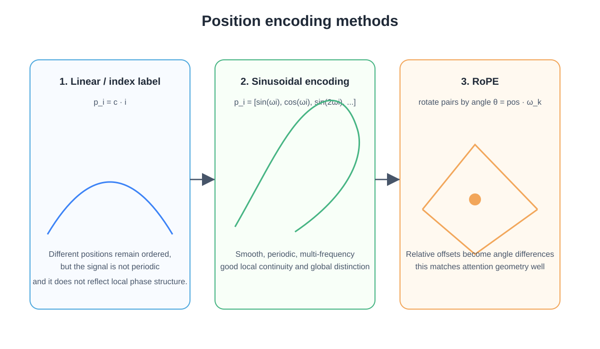
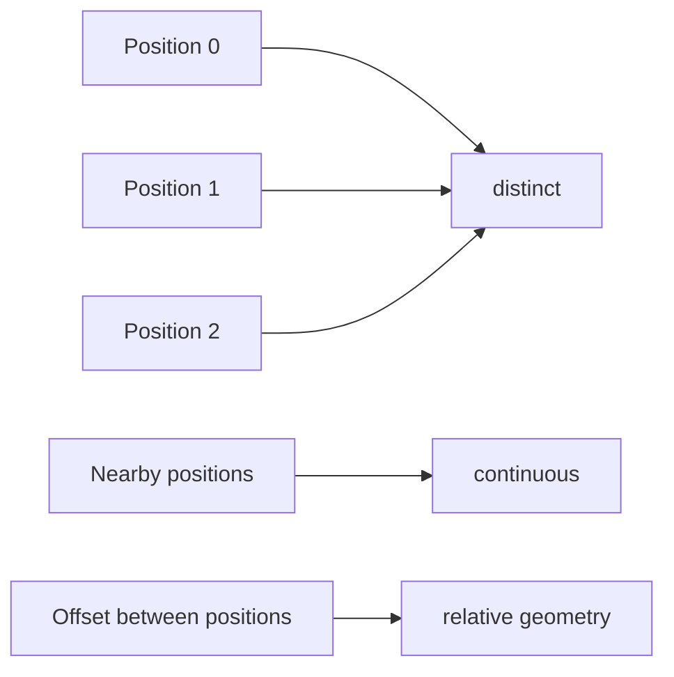
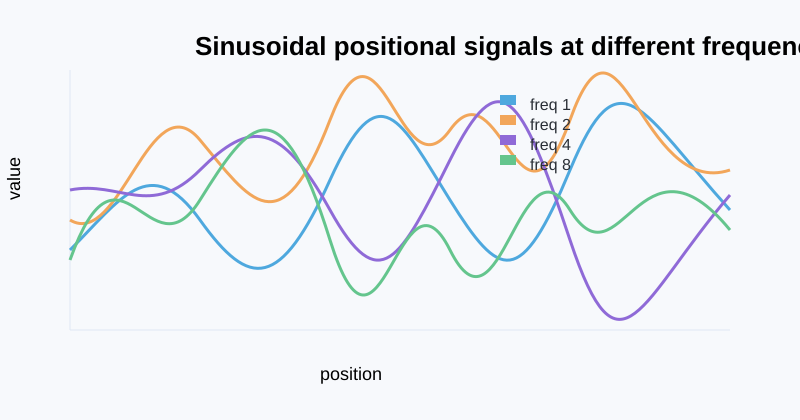

# Part 2: Position, phase, and the geometry of order

This chapter is built the way you want: start with a tiny concrete example, then the numerical intuition, then the geometry, then the formal math, and only then the generalization.

The key question is simple:

> if a model sees only token identities, how does it know which word came first, second, or third?

The answer is positional encoding.

**Foundation connection:** This chapter builds directly on [frequency and rotation in the foundation chapter](module_01_foundations.md#foundation-frequency), and it leads into the [attention chapter](part_03_attention.md), where this positional signal is used in query-key matching.

## 1. The problem in plain language

The same vocabulary items can appear in different orders and mean different things:

- “dog bites man”
- “man bites dog”

A token embedding tells us what the word is. It does not tell us where the word sits in the sentence.

So a pure token-only representation is still missing the structure of the sequence.

This is the first principle:

> language is not a bag of tokens; it is a sequence of tokens.

The model therefore needs a signal for position.

## 2. A minimal example before the equations

Take the same word twice. We want the same token to be represented differently depending on whether it appears first, second, or third.

Let the word embedding be:

$$
e_{\text{word}} = [1, 0]
$$

and let the position offsets be:

$$
p_0 = [1, 0], \quad p_1 = [0, 1], \quad p_2 = [-1, 0]
$$

Then the token representation becomes:

$$
h_0 = e_{\text{word}} + p_0 = [2, 0]
$$

$$
h_1 = e_{\text{word}} + p_1 = [1, 1]
$$

$$
h_2 = e_{\text{word}} + p_2 = [0, 0]
$$

So the exact same token now lives in different coordinates depending on its position.

This is the intuition behind positional encoding. It is not magic. It is simply adding a position-dependent offset to the token representation.

The figure below shows the same idea in geometric form: the same token is placed in different coordinates depending on its position in the sequence.



The exact numbers are not the final method. The point is simple: the token representation changes with its position.

## 3. The three properties of a good positional encoding

A useful positional code should satisfy three properties:

1. Distinctness: two positions should not collapse to the same code.
2. Local continuity: nearby positions should be nearby in feature space.
3. Relative structure: the code should reflect distance and offset, not just absolute index.

These are the three properties that matter most.

This is the real motivation behind the standard solution. A good code is not just “different numbers for different positions.” It should preserve sequence structure in a smooth, usable way.



## 4. Why the raw index alone is not enough

A first thought is to use the index directly:

$$
PE(p) = p
$$

This gives a clearly ordered signal, but it is not a good geometric one. The values grow linearly and do not naturally encode local continuity or smooth distance relationships.

A position signal should feel like structure, not a hard-coded label.

So we move to a periodic signal, and the natural choice is the sine/cosine family.

## 5. The Transformer paper’s absolute position formula

The [original Transformer paper](https://arxiv.org/abs/1706.03762) uses a fixed sinusoidal positional encoding. Before reading the formula, separate its three indices:

- $p$ selects a **token position**: 0 for the first token, 1 for the second, and so on.
- $j$ selects one **coordinate** of the $d$-dimensional vector: $j=0,1,\ldots,d-1$.
- $k$ selects one **sine/cosine pair**. Pair $k$ occupies coordinates $j=2k$ and $j=2k+1$.

So $k$ is not a token index and not a position. If $d=8$, there are $d/2=4$ pairs:

| pair index $k$ | vector coordinates | sine coordinate | cosine coordinate |
|---:|---:|---:|---:|
| 0 | 0 and 1 | $PE(p,0)$ | $PE(p,1)$ |
| 1 | 2 and 3 | $PE(p,2)$ | $PE(p,3)$ |
| 2 | 4 and 5 | $PE(p,4)$ | $PE(p,5)$ |
| 3 | 6 and 7 | $PE(p,6)$ | $PE(p,7)$ |

For each position $p$ and each feature dimension $2k$ and $2k+1$,

$$
PE(p, 2k) = \sin\left(\frac{p}{10000^{2k/d}}\right)
$$

$$
PE(p, 2k+1) = \cos\left(\frac{p}{10000^{2k/d}}\right)
$$

or equivalently in the common form:

$$
PE(p, 2k) = \sin(p \omega_k), \qquad PE(p, 2k+1) = \cos(p \omega_k)
$$

where

$$
\omega_k = 10000^{-2k/d}
$$

The same $\omega_k$ is used by both coordinates in pair $k$. One stores the sine of the phase and the other stores its cosine:

$$
\underbrace{[PE(p,2k),PE(p,2k+1)]}_{\text{pair }k}
= [\sin(p\omega_k),\cos(p\omega_k)].
$$

For $d=8$, the four angular frequencies are especially easy to inspect:

| $k$ | $\omega_k=10000^{-2k/8}$ | phase advance per token | period $2\pi/\omega_k$ |
|---:|---:|---:|---:|
| 0 | $1$ | $1$ radian | about $6.28$ tokens |
| 1 | $0.1$ | $0.1$ radian | about $62.8$ tokens |
| 2 | $0.01$ | $0.01$ radian | about $628$ tokens |
| 3 | $0.001$ | $0.001$ radian | about $6{,}283$ tokens |

The first pair changes rapidly from one position to the next. Later pairs change progressively more slowly.

The token embedding and position vector have the same width and are combined coordinate by coordinate. Writing the paper's embedding scale explicitly,

$$
h_p = \underbrace{\sqrt{d}\,e_{x_p}}_{\widetilde e_{x_p}} + PE(p).
$$

Many explanations abbreviate this as $h_p=e_{x_p}+PE(p)$ by using $e_{x_p}$ to mean the already-scaled embedding $\widetilde e_{x_p}$. The positional formula itself remains the same.

### What each piece means

- $p$ is the position index
- $d$ is the embedding dimension
- $k\in\{0,\ldots,d/2-1\}$ chooses the feature pair $(2k,2k+1)$ and therefore its frequency
- $\omega_k$ gives the frequency for that pair
- $PE(p)$ is the position signal added to the token embedding

The position signal is fixed and deterministic. The model does not learn a separate vector for each position in this version. It computes the vector from $p$, $k$, and $d$.

## 6. A small numerical example of the sinusoidal formula

With $d=8$, the complete positional vector is

$$
PE(p)=[\sin(p),\cos(p),\sin(0.1p),\cos(0.1p),
\sin(0.01p),\cos(0.01p),\sin(0.001p),\cos(0.001p)].
$$

The first three positions are:

| position $p$ | $PE(p)$, rounded to four decimals |
|---:|---|
| 0 | $[0,1,\;0,1,\;0,1,\;0,1]$ |
| 1 | $[0.8415,0.5403,\;0.0998,0.9950,\;0.0100,1.0000,\;0.0010,1.0000]$ |
| 2 | $[0.9093,-0.4161,\;0.1987,0.9801,\;0.0200,0.9998,\;0.0020,1.0000]$ |

Notice the leftmost pair changing visibly at every step while the rightmost pair barely moves over these three positions.

### From words to position-aware vectors

Consider the tokenized sentence **“the cat sat”**. Suppose the embedding stage, after any model-specific scaling, returns these small, illustrative vectors:

$$
e_{\text{the}}=[0.2,-0.1,0.4,0.3,-0.2,0.5,0.1,-0.3]
$$

$$
e_{\text{cat}}=[-0.4,0.7,0.1,-0.2,0.6,-0.1,0.3,0.2]
$$

$$
e_{\text{sat}}=[0.5,0.2,-0.3,0.1,0.2,0.4,-0.5,0.6].
$$

Each row receives the code for its own position:

| token | $p$ | operation | position-aware vector $h_p$ |
|---|---:|---|---|
| the | 0 | $e_{\text{the}}+PE(0)$ | $[0.2,0.9,0.4,1.3,-0.2,1.5,0.1,0.7]$ |
| cat | 1 | $e_{\text{cat}}+PE(1)$ | $[0.4415,1.2403,0.1998,0.7950,0.6100,0.9000,0.3010,1.2000]$ |
| sat | 2 | $e_{\text{sat}}+PE(2)$ | $[1.4093,-0.2161,-0.1013,1.0801,0.2200,1.3998,-0.4980,1.6000]$ |

The word identity has not been replaced. Each output contains the word embedding **plus** a reusable code for the row where that word occurred. If “cat” moved from position 1 to position 2, its embedding lookup would stay the same but the added $PE$ vector would change.

Real embeddings are wider. For $d=64$, we can write the full idea without printing 64 numbers:

$$
e_{\text{cat}}=[0.12,-0.31,0.08,0.44,\ldots,-0.07,0.19]\in\mathbb{R}^{64},
$$

$$
PE(1)=[\sin(1),\cos(1),\sin(\omega_1),\cos(\omega_1),\ldots,
\sin(\omega_{31}),\cos(\omega_{31})]\in\mathbb{R}^{64},
$$

$$
h_{\text{cat at }p=1}=e_{\text{cat}}+PE(1)\in\mathbb{R}^{64}.
$$

The dots stand for the middle coordinate pairs; every one of the 64 coordinates still participates in the addition.

The figure below shows the position-dependent pattern generated by the same formula. Each row is a position, and each column is one coordinate of the code.



This gives a smooth, structured pattern in which nearby positions differ in a controlled, geometrically meaningful way.

## 7. Why different frequencies matter

A single sinusoid is not enough.

If we use only one frequency, then the code changes too uniformly and may not capture both local and long-range structure well. We need a frequency ladder.

This is why each feature pair uses a different $\omega_k$.

A low-frequency component varies slowly, which is useful for coarse, long-range position structure. A high-frequency component varies quickly, which is useful for distinguishing nearby positions.


The plot shows the same idea visually:

- low frequency = slow, long-range variation
- high frequency = fast, local variation
- the full positional encoding mixes these scales together

### Which end changes faster?

Because $0<10000^{-2/d}<1$, increasing $k$ makes $\omega_k$ smaller:

$$
k\uparrow \quad\Longrightarrow\quad \omega_k\downarrow
\quad\Longrightarrow\quad \text{less phase change per token}.
$$

So the direction is:

- **small pair index $k$**: high frequency, short period, large change between nearby positions
- **large pair index $k$**: low frequency, long period, small change between nearby positions

For one pair, define $u_k(p)=[\sin(p\omega_k),\cos(p\omega_k)]$. Its exact change over one token step is

$$
\lVert u_k(p+1)-u_k(p)\rVert
=2\left|\sin\left(\frac{\omega_k}{2}\right)\right|
\approx \omega_k \quad\text{when }\omega_k\text{ is small}.
$$

This makes “changes more slowly” precise. For $d=8$, pair 0 changes by about $0.959$ per step, while pair 3 changes by about $0.001$ per step.

!!! important "Slow change does not mean weak magnitude"
    Every sine/cosine pair has norm 1 because $\sin^2\theta+\cos^2\theta=1$. A high-$k$ pair therefore is not smaller; it simply rotates more slowly. Increasing $d$ adds more pairs and packs more frequencies between the fast and slow ends. It does **not** make positional information uniformly less prominent. The relative influence of the added position vector and the learned token vector depends on their scales; in the original Transformer the token embedding is scaled by $\sqrt d$ before addition.

For $d=64$, $k$ runs from 0 through 31. The frequency falls from $\omega_0=1$ to $\omega_{31}\approx1.33\times10^{-4}$ radians per token. Pair 0 completes a cycle in about 6 tokens; pair 31 takes about 47,100 tokens. The representation therefore contains both a fast “second hand” and many progressively slower “minute and hour hands.”

### Interactive frequency and relative-offset lab

Move the pair index $k$ from 0 toward 31. Watch $\omega_k$ decrease, the period grow, and the wave flatten over the same 50-token window. Then change the relative offset $\Delta$ to see the RoPE identity $\cos(\omega_k\Delta)$.

<iframe src="../assets/lab_position.html" title="Interactive positional frequency and rotation lab" loading="lazy" style="width:100%;height:620px;border:0;border-radius:12px"></iframe>

[Open the position lab on its own page](assets/lab_position.html) if you want more room for the controls.

## 8. Why sine and cosine are paired together

A single sine value can be ambiguous. Two angles can have the same sine but different cosine values.

The formula stores each pair in $[\sin\theta,\cos\theta]$ order. For the familiar $(x,y)$ unit-circle convention, it is convenient to write the same two coordinates in the reverse order:

$$
(\cos\theta, \sin\theta)
$$

Together they encode the phase of the angle.

This is the key geometric observation:

> a position change is really a change in angle, not just a change in a scalar value.

The pair changes under rotation:

$$
\begin{bmatrix}
\cos(\theta+\phi) \\
\sin(\theta+\phi)
\end{bmatrix}
=
\begin{bmatrix}
\cos\phi & -\sin\phi \\
\sin\phi & \cos\phi
\end{bmatrix}
\begin{bmatrix}
\cos\theta \\
\sin\theta
\end{bmatrix}
$$

This means that shifting position by $\phi$ is just rotating the vector in the feature plane.

That is the geometric heart of positional encoding.

### Visual: phase on the unit circle


This is the phase picture in one line: as position increases, the point moves around the unit circle.

### Visual: frequency ladder and sinusoidal waves


The plot makes the geometry concrete:

- low frequencies change slowly and encode coarse position
- high frequencies change quickly and encode local distinctions
- the full encoding mixes these scales together

## 9. The phase interpretation

The code can be seen as a phase signal. Let

$$
\theta_p = \omega p
$$

Then the position feature is determined by the phase angle at index $p$.

This gives a smooth structure because the signal is periodic and continuous in $p$.

The cycle is:

- 0 radians: point at $(1, 0)$
- $\pi/2$: point at $(0, 1)$
- $\pi$: point at $(-1, 0)$
- $3\pi/2$: point at $(0, -1)$

So a position offset corresponds to movement around the unit circle.

This is exactly why the expression “position as phase” is so useful.

## 10. Why relative distance matters

A strong positional encoding should not only mark absolute index; it should also capture how far apart positions are.

The dot product between two phase vectors is:

$$
[\cos(\omega m),\sin(\omega m)] \cdot [\cos(\omega n),\sin(\omega n)] = \cos(\omega(m-n))
$$

This is a very important identity.

It says the comparison depends on the difference $m-n$, not on the absolute index alone.

This is the deeper reason phase-based encodings are useful:

- they make position differences visible
- they encode offset through geometry
- they support relative reasoning naturally

This is the bridge between positional encoding and attention.

## 11. The complex-number view, introduced at the right point

Now that the intuition is built, the complex-number language becomes natural and compact.

A complex number is:

$$
z = a + ib
$$

with $i^2 = -1$.

It corresponds to a point $(a,b)$ in the plane. Multiplying by $e^{i\theta}$ rotates that point by angle $\theta$.

Euler’s formula is:

$$
e^{i\theta} = \cos\theta + i\sin\theta
$$

and therefore:

$$
e^{i\alpha} e^{i\beta} = e^{i(\alpha + \beta)}
$$

This is the clean geometric language for the same idea we already saw with sine and cosine.

A position code can be written as:

$$
z_p = e^{i\omega p}
$$

This means:

- position changes become angle changes
- angle changes become rotations
- relative offset becomes angle difference

This is the compact mathematical form behind the phase picture.

## 12. The generalization to RoPE

[RoPE](https://arxiv.org/abs/2104.09864) uses the same frequency-and-phase idea at a different point in the computation. It was introduced after the original Transformer; it is a later positional method, not part of the 2017 architecture.

The original Transformer adds a fixed sinusoidal position code to the token embedding:

$$
h_p = e_{x_p} + PE(p)
$$

RoPE normally does not add a position vector to the token embedding. A layer first forms content-dependent queries and keys using its learned projection matrices:

$$
q_p=h_pW_Q,\qquad k_p=h_pW_K.
$$

It then rotates pairs inside $q_p$ and $k_p$ according to position $p$. Standard RoPE applies this operation to queries and keys, not to the value vector.

### A sentence entering one attention head

For **“the cat sat”**, suppose the residual-stream rows are 64-dimensional:

$$
H=
\begin{bmatrix}
h_{\text{the}}\\
h_{\text{cat}}\\
h_{\text{sat}}
\end{bmatrix}
\in\mathbb{R}^{3\times64}.
$$

One head projects all three rows:

$$
Q=HW_Q,\qquad K=HW_K.
$$

Before RoPE, a query and key may look like

$$
q_{\text{cat}}=[q_0,q_1,\;q_2,q_3,\;\ldots,\;q_{62},q_{63}],
$$

$$
k_{\text{sat}}=[k_0,k_1,\;k_2,k_3,\;\ldots,\;k_{62},k_{63}].
$$

The separators expose the 32 two-dimensional planes. Pair $k=0$ contains coordinates $(0,1)$, pair $k=1$ contains $(2,3)$, and so on. Each plane receives its own frequency $\omega_k$.

For a 2D rotation matrix,

$$
R(\theta) =
\begin{bmatrix}
\cos\theta & -\sin\theta \\
\sin\theta & \cos\theta
\end{bmatrix}
$$

the position-dependent rotation is

$$
q'_m = R(m\omega) q_m,
\qquad
k'_n = R(n\omega) k_n.
$$

This is the core RoPE idea: the vector is rotated by an angle proportional to its position.

For pair $k$, the coordinate-level calculation is

$$
\begin{bmatrix}
q'_{p,2k}\\q'_{p,2k+1}
\end{bmatrix}
=
\begin{bmatrix}
\cos(p\omega_k)&-\sin(p\omega_k)\\
\sin(p\omega_k)&\cos(p\omega_k)
\end{bmatrix}
\begin{bmatrix}
q_{p,2k}\\q_{p,2k+1}
\end{bmatrix},
$$

and the same rule is applied to the matching key pair. The vector still has 64 coordinates after all 32 pairs are rotated.

### Rotation versus translation

RoPE performs a **rotation**, not an additive geometric translation. The pair keeps its length and turns around the origin. Moving a token from position $p$ to $p+1$ changes the rotation angle from $p\omega_k$ to $(p+1)\omega_k$.

The word “translation” sometimes appears in another sense: translating, or shifting, the **whole sentence** by the same number of positions. Holding the unrotated content vectors fixed, RoPE gives the query-key dot product a useful invariance to that shared shift. If $m$ and $n$ both become $m+c$ and $n+c$, then their difference remains

$$
(n+c)-(m+c)=n-m.
$$

Now the attention score becomes:

$$
(q'_m)^\top k'_n
= (R(m\omega) q_m)^\top (R(n\omega) k_n)
= q_m^\top R(-m\omega) R(n\omega) k_n
= q_m^\top R((n-m)\omega) k_n.
$$

This equation is the whole story. The important thing is that the angle is $(n-m)\omega$, not just $m\omega$ or $n\omega$ separately. The score depends on the offset between positions.

This is the same idea as before:

- the original fixed positional code made position a phase signal
- RoPE makes the phase signal appear directly in the query-key comparison
- relative distance is encoded as a rotation difference

### Why this matters

A token at position $m$ and a token at position $n$ are compared after rotating each vector by its position. When the model computes the dot product, the angle difference is $n-m$. That means the score is sensitive to relative distance, not just to absolute index.

This is exactly the property we wanted from a positional code: nearby tokens should have a meaningful relative relation, and the model can use the offset directly in the attention score.

### Worked sentence example: “cat” attends to “sat”

Focus on one pair so every number is visible. Use $\omega=\pi/6$ radians per token for this teaching example. Suppose the learned projections produce

$$
q_{\text{cat}} = \begin{bmatrix} 1 \\ 2 \end{bmatrix},
\qquad
k_{\text{sat}} = \begin{bmatrix} 2 \\ 1 \end{bmatrix}.
$$

“cat” is at $m=1$, so its pair rotates by $\pi/6=30^\circ$:

$$
q'_{\text{cat}}
=R(\pi/6)\begin{bmatrix}1\\2\end{bmatrix}
\approx\begin{bmatrix}-0.134\\2.232\end{bmatrix}.
$$

“sat” is at $n=2$, so its pair rotates by $2\pi/6=60^\circ$:

$$
k'_{\text{sat}}
=R(2\pi/6)\begin{bmatrix}2\\1\end{bmatrix}
\approx\begin{bmatrix}0.134\\2.232\end{bmatrix}.
$$

Their contribution to the attention score is

$$
(q'_{\text{cat}})^\top k'_{\text{sat}}
\approx(-0.134)(0.134)+(2.232)(2.232)
\approx4.964.
$$

The same result can be computed using only the relative offset $n-m=1$:

$$
q_{\text{cat}}^\top R((2-1)\pi/6)k_{\text{sat}}
\approx4.964.
$$

If the same content appeared at positions 8 and 9, both vectors would undergo much larger absolute rotations, but their relative angle would still be one step, $\pi/6$. This pair's dot-product contribution would remain approximately $4.964$.

In a real 64-dimensional head, the attention score adds the contributions from all 32 frequency pairs and then applies the usual $1/\sqrt{d_h}$ scaling. The learned $W_Q$ and $W_K$ decide the content coordinates; RoPE changes how those coordinates align at a particular relative distance.

This is the concrete meaning of the formula:

- the token vectors are not just tagged with a number
- they are rotated in feature space by their position
- the attention score then naturally depends on the difference between positions

### Relationship to the original Transformer formula

The original sinusoidal encoding and RoPE share sine/cosine frequencies, but they are not the same operation:

- **original Transformer:** add $PE(p)$ to the token representation before it enters the attention projections
- **RoPE:** project to $Q$ and $K$ first, then rotate each pair inside those vectors
- **additive encoding:** position can affect queries, keys, and values through the later learned projections
- **RoPE:** relative phase appears directly and algebraically in the query-key score

RoPE can be viewed as a more direct relative-position inductive bias for attention. It is not simply “more complete” than the original formula: it inserts position in a different place and gives a different guarantee. The original sinusoidal code also has relative structure because a fixed offset can be represented by a linear transformation of its sine/cosine pairs, but RoPE exposes the offset $n-m$ directly in each rotated query-key dot product.

### NumPy translation of the pairwise math

```python
import numpy as np

def apply_rope(x, positions, base=10_000.0):
    """x has shape (sequence_length, head_dimension)."""
    sequence_length, head_dimension = x.shape
    assert head_dimension % 2 == 0

    # k = 0, 1, ..., head_dimension/2 - 1
    k = np.arange(head_dimension // 2)
    omega = base ** (-2 * k / head_dimension)
    angles = positions[:, None] * omega[None, :]

    even = x[:, 0::2]
    odd = x[:, 1::2]
    rotated_even = even * np.cos(angles) - odd * np.sin(angles)
    rotated_odd = even * np.sin(angles) + odd * np.cos(angles)

    return np.stack([rotated_even, rotated_odd], axis=-1).reshape(x.shape)

Q = H @ W_Q
K = H @ W_K
positions = np.arange(H.shape[0])
Q_rope = apply_rope(Q, positions)
K_rope = apply_rope(K, positions)
scores = Q_rope @ K_rope.T / np.sqrt(Q.shape[-1])
```

Read the code pair by pair: `even` and `odd` hold the two coordinates of every plane, `angles[p, k]` is $p\omega_k$, and the two `rotated_...` lines are exactly the 2D rotation matrix.

### Conceptual summary

- additive positional encoding: position is a vector offset
- RoPE: position is a rotation angle in the attention space
- shared idea: phase differences encode relative distance

## 13. A complete picture


This is the full story in one diagram:

- the token gives identity
- the position code gives order
- the attention layer uses geometry to compare positions
- the model learns which context matters

## 14. Key takeaway

The sequence problem is the first principle:

> without position, a model cannot distinguish order.

The Transformer paper solves this with an additive sinusoidal code:

$$
h_p = e_{x_p} + PE(p)
$$

where the position code is built from smooth phase signals:

$$
PE(p, 2k) = \sin(p\omega_k), \qquad PE(p, 2k+1) = \cos(p\omega_k)
$$

The geometric meaning is simple:

- position is a phase angle
- phase differences encode offsets
- relative position enters naturally through rotation
- RoPE is the generalization of this idea into the attention geometry

That is the full story of positional encoding in a Transformer.

The next chapter takes this position-aware representation and uses it to explain how attention decides which tokens matter.
