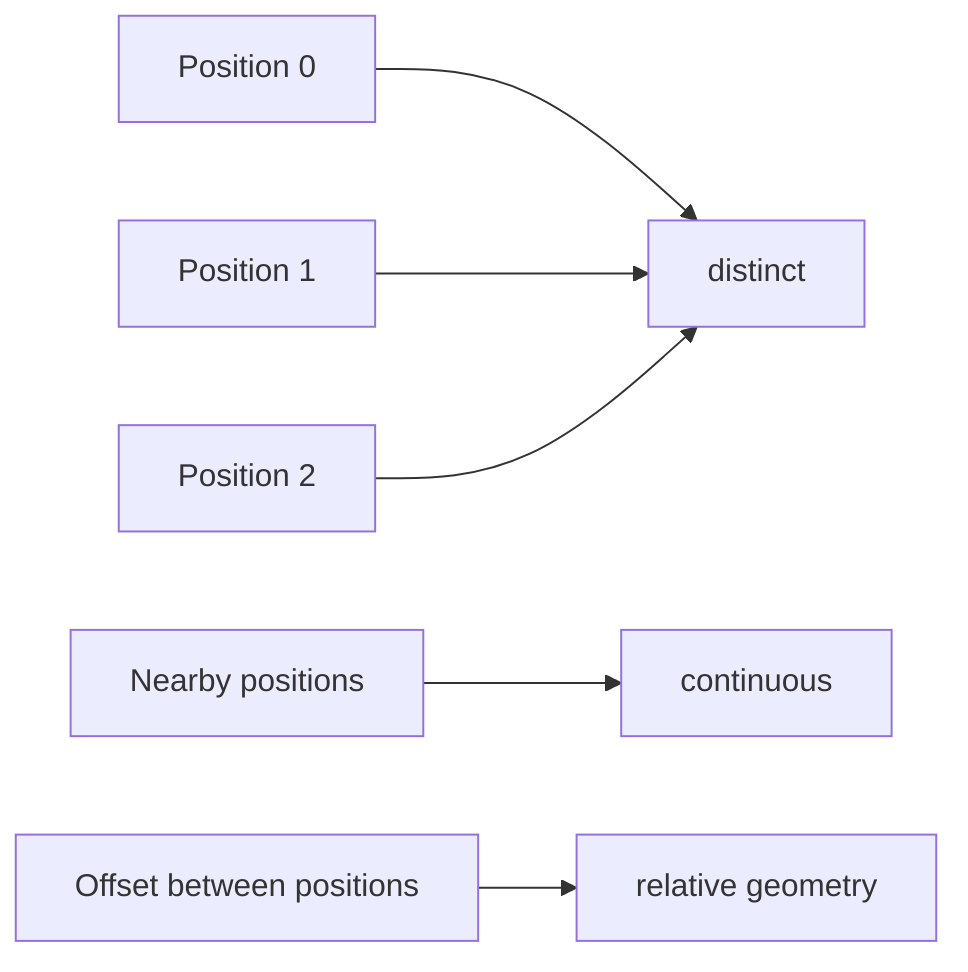

# Part 2: Position, phase, and the geometry of order

This chapter is built the way you want: start with a tiny concrete example, then the numerical intuition, then the geometry, then the formal math, and only then the generalization.

The key question is simple:

> if a model sees only token identities, how does it know which word came first, second, or third?

The answer is positional encoding.

**Foundation connection:** This chapter builds directly on [frequency and rotation in the foundation chapter](module_01_foundations.md#foundation-frequency), and it leads into the [attention chapter](part_03_attention.md), where this positional signal is used in query-key matching.

## 1. The problem in plain language

The same vocabulary items can appear in different orders and mean different things:

- “dog bites man”
- “man bites dog”

A token embedding tells us what the word is. It does not tell us where the word sits in the sentence.

So a pure token-only representation is still missing the structure of the sequence.

This is the first principle:

> language is not a bag of tokens; it is a sequence of tokens.

The model therefore needs a signal for position.

## 2. A minimal example before the equations

Take the same word twice. We want the same token to be represented differently depending on whether it appears first, second, or third.

Let the word embedding be:

$$
e_{\text{word}} = [1, 0]
$$

and let the position offsets be:

$$
p_0 = [1, 0], \quad p_1 = [0, 1], \quad p_2 = [-1, 0]
$$

Then the token representation becomes:

$$
h_0 = e_{\text{word}} + p_0 = [2, 0]
$$

$$
h_1 = e_{\text{word}} + p_1 = [1, 1]
$$

$$
h_2 = e_{\text{word}} + p_2 = [0, 0]
$$

So the exact same token now lives in different coordinates depending on its position.

This is the intuition behind positional encoding. It is not magic. It is simply adding a position-dependent offset to the token representation.

The figure below shows the same idea in geometric form: the same token is placed in different coordinates depending on its position in the sequence.

The exact numbers are not the final method. The point is simple: the token representation changes with its position.

## 3. The three properties of a good positional encoding

A useful positional code should satisfy three properties:

1. Distinctness: two positions should not collapse to the same code.
2. Local continuity: nearby positions should be nearby in feature space.
3. Relative structure: the code should reflect distance and offset, not just absolute index.

These are the three properties that matter most.

This is the real motivation behind the standard solution. A good code is not just “different numbers for different positions.” It should preserve sequence structure in a smooth, usable way.

## 4. Why the raw index alone is not enough

A first thought is to use the index directly:

$$
PE(p) = p
$$

This gives a clearly ordered signal, but it is not a good geometric one. The values grow linearly and do not naturally encode local continuity or smooth distance relationships.

A position signal should feel like structure, not a hard-coded label.

So we move to a periodic signal, and the natural choice is the sine/cosine family.

## 5. The Transformer paper’s absolute position formula

The Transformer paper uses a fixed sinusoidal positional encoding. This is the core design.

For each position $p$ and each feature dimension $2k$ and $2k+1$,

$$
PE(p, 2k) = \sin\left(\frac{p}{10000^{2k/d}}\right)
$$

$$
PE(p, 2k+1) = \cos\left(\frac{p}{10000^{2k/d}}\right)
$$

or equivalently in the common form:

$$
PE(p, 2k) = \sin(p \omega_k), \qquad PE(p, 2k+1) = \cos(p \omega_k)
$$

where

$$
\omega_k = 10000^{-2k/d}
$$

The token embedding and position vector are then combined additively:

$$
h_p = e_{x_p} + PE(p)
$$

This is the exact Transformer-style positional encoding.

### What each piece means

- $p$ is the position index
- $d$ is the embedding dimension
- $k$ indexes the feature pair
- $\omega_k$ gives the frequency for that pair
- $PE(p)$ is the position signal added to the token embedding

The important thing is that the position signal is fixed and deterministic. The model does not learn a separate positional vector per index. Instead, the position code is a smooth mathematical formula.

## 6. A small numerical example of the sinusoidal formula

The figure below shows the position-dependent pattern generated by the sinusoidal formula. Each row is a position, and each column is a dimension in the code.

This gives a smooth, structured pattern in which nearby positions differ in a controlled, geometrically meaningful way.

## 7. Why different frequencies matter

A single sinusoid is not enough.

If we use only one frequency, then the code changes too uniformly and may not capture both local and long-range structure well. We need a frequency ladder.

This is why each feature pair uses a different $\omega_k$.

A low-frequency component varies slowly, which is useful for coarse positional structure. A high-frequency component varies quickly, which is useful for fine local distinctions.

The plot shows the same idea visually:

- low frequency = slow, long-range variation
- high frequency = fast, local variation
- the full positional encoding mixes these scales together

## 8. Why sine and cosine are paired together

A single sine value can be ambiguous. Two angles can have the same sine but different cosine values.

That is why we use the pair:

$$
(\cos\theta, \sin\theta)
$$

Together they encode the phase of the angle.

This is the key geometric observation:

> a position change is really a change in angle, not just a change in a scalar value.

The pair changes under rotation:

$$
\begin{bmatrix}
\cos(\theta+\phi) \\
\sin(\theta+\phi)
\end{bmatrix}
=
\begin{bmatrix}
\cos\phi & -\sin\phi \\
\sin\phi & \cos\phi
\end{bmatrix}
\begin{bmatrix}
\cos\theta \\
\sin\theta
\end{bmatrix}
$$

This means that shifting position by $\phi$ is just rotating the vector in the feature plane.

That is the geometric heart of positional encoding.

### Visual: phase on the unit circle

This is the phase picture in one line: as position increases, the point moves around the unit circle.

### Visual: frequency ladder and sinusoidal waves

The plot makes the geometry concrete:

- low frequencies change slowly and encode coarse position
- high frequencies change quickly and encode local distinctions
- the full encoding mixes these scales together

## 9. The phase interpretation

The code can be seen as a phase signal. Let

$$
\theta_p = \omega p
$$

Then the position feature is determined by the phase angle at index $p$.

This gives a smooth structure because the signal is periodic and continuous in $p$.

The cycle is:

- 0 radians: point at $(1, 0)$
- $\pi/2$: point at $(0, 1)$
- $\pi$: point at $(-1, 0)$
- $3\pi/2$: point at $(0, -1)$

So a position offset corresponds to movement around the unit circle.

This is exactly why the expression “position as phase” is so useful.

## 10. Why relative distance matters

A strong positional encoding should not only mark absolute index; it should also capture how far apart positions are.

The dot product between two phase vectors is:

$$
[\cos(\omega m),\sin(\omega m)] \cdot [\cos(\omega n),\sin(\omega n)] = \cos(\omega(m-n))
$$

This is a very important identity.

It says the comparison depends on the difference $m-n$, not on the absolute index alone.

This is the deeper reason phase-based encodings are useful:

- they make position differences visible
- they encode offset through geometry
- they support relative reasoning naturally

This is the bridge between positional encoding and attention.

## 11. The complex-number view, introduced at the right point

Now that the intuition is built, the complex-number language becomes natural and compact.

A complex number is:

$$
z = a + ib
$$

with $i^2 = -1$.

It corresponds to a point $(a,b)$ in the plane. Multiplying by $e^{i\theta}$ rotates that point by angle $\theta$.

Euler’s formula is:

$$
e^{i\theta} = \cos\theta + i\sin\theta
$$

and therefore:

$$
e^{i\alpha} e^{i\beta} = e^{i(\alpha + \beta)}
$$

This is the clean geometric language for the same idea we already saw with sine and cosine.

A position code can be written as:

$$
z_p = e^{i\omega p}
$$

This means:

- position changes become angle changes
- angle changes become rotations
- relative offset becomes angle difference

This is the compact mathematical form behind the phase picture.

## 12. The generalization to RoPE

RoPE is not a new concept from nowhere. It is the same phase idea moved into the attention geometry itself.

The original Transformer adds a fixed sinusoidal position code to the token embedding:

$$
h_p = e_{x_p} + PE(p)
$$

RoPE keeps the token embedding itself and instead rotates the query and key vectors according to their positions.

For a 2D rotation matrix,

$$
R(\theta) =
\begin{bmatrix}
\cos\theta & -\sin\theta \\
\sin\theta & \cos\theta
\end{bmatrix}
$$

the position-dependent rotation is

$$
q'_m = R(m\omega) q_m,
\qquad
k'_n = R(n\omega) k_n.
$$

This is the core RoPE idea: the vector is rotated by an angle proportional to its position.

Now the attention score becomes:

$$
(q'_m)^\top k'_n
= (R(m\omega) q_m)^\top (R(n\omega) k_n)
= q_m^\top R(-m\omega) R(n\omega) k_n
= q_m^\top R((n-m)\omega) k_n.
$$

This equation is the whole story. The important thing is that the angle is $(n-m)\omega$, not just $m\omega$ or $n\omega$ separately. The score depends on the offset between positions.

This is the same idea as before:

- the original fixed positional code made position a phase signal
- RoPE makes the phase signal appear directly in the query-key comparison
- relative distance is encoded as a rotation difference

### Why this matters

A token at position $m$ and a token at position $n$ are compared after rotating each vector by its position. When the model computes the dot product, the angle difference is $n-m$. That means the score is sensitive to relative distance, not just to absolute index.

This is exactly the property we wanted from a positional code: nearby tokens should have a meaningful relative relation, and the model can use the offset directly in the attention score.

### Worked example with 2D vectors

Take a simple case with a single frequency $\omega = \pi/2$ and the same token vector at two different positions:

$$
q = \begin{bmatrix} 1 \\ 0 \end{bmatrix},
\qquad
k = \begin{bmatrix} 1 \\ 0 \end{bmatrix}.
$$

At positions $m=0$ and $n=1$:

$$
q'_0 = R(0) q = \begin{bmatrix} 1 \\ 0 \end{bmatrix},
\qquad
k'_1 = R(\pi/2) k = \begin{bmatrix} 0 \\ 1 \end{bmatrix}.
$$

The score is

$$
(q'_0)^\top k'_1 = \begin{bmatrix} 1 & 0 \end{bmatrix}
\begin{bmatrix} 0 \\ 1 \end{bmatrix} = 0.
$$

Now compare the same vectors with positions $m=0$ and $n=2$:

$$
k'_2 = R(\pi) k = \begin{bmatrix} -1 \\ 0 \end{bmatrix}.
$$

Then

$$
(q'_0)^\top k'_2 = \begin{bmatrix} 1 & 0 \end{bmatrix}
\begin{bmatrix} -1 \\ 0 \end{bmatrix} = -1.
$$

So the score changed from $0$ to $-1$ just because the relative offset moved from $1$ to $2$.

This is the concrete meaning of the formula:

- the token vectors are not just tagged with a number
- they are rotated in feature space by their position
- the attention score then naturally depends on the difference between positions

### Relationship to the original Transformer formula

The original sinusoidal positional encoding and RoPE are the same geometric family:

- original Transformer: add a deterministic position signal to the embedding
- RoPE: rotate query and key vectors by position before comparison
- both encode the same fact: position is a phase and relative offset matters

The difference is where the phase enters the computation. In the original Transformer, it is added to the representation. In RoPE, it is embedded inside the attention geometry.

### Conceptual summary

- additive positional encoding: position is a vector offset
- RoPE: position is a rotation angle in the attention space
- shared idea: phase differences encode relative distance

## 13. A complete picture

This is the full story in one diagram:

- the token gives identity
- the position code gives order
- the attention layer uses geometry to compare positions
- the model learns which context matters

## 14. Key takeaway

The sequence problem is the first principle:

> without position, a model cannot distinguish order.

The Transformer paper solves this with an additive sinusoidal code:

$$
h_p = e_{x_p} + PE(p)
$$

where the position code is built from smooth phase signals:

$$
PE(p, 2k) = \sin(p\omega_k), \qquad PE(p, 2k+1) = \cos(p\omega_k)
$$

The geometric meaning is simple:

- position is a phase angle
- phase differences encode offsets
- relative position enters naturally through rotation
- RoPE is the generalization of this idea into the attention geometry

That is the full story of positional encoding in a Transformer.

The next chapter takes this position-aware representation and uses it to explain how attention decides which tokens matter.
