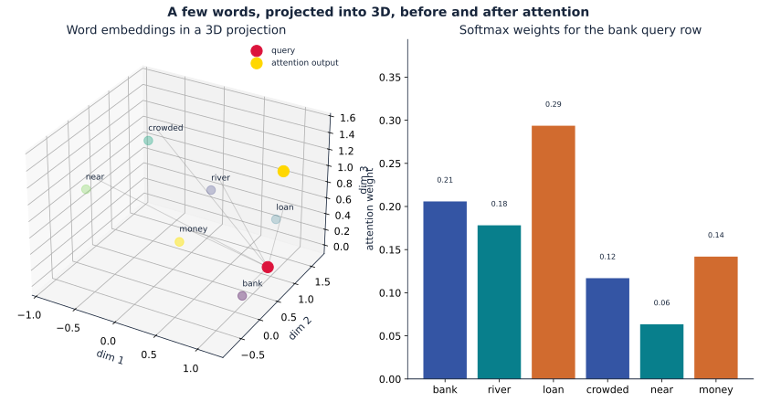
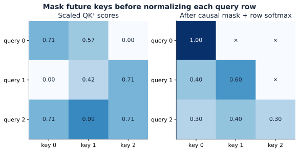
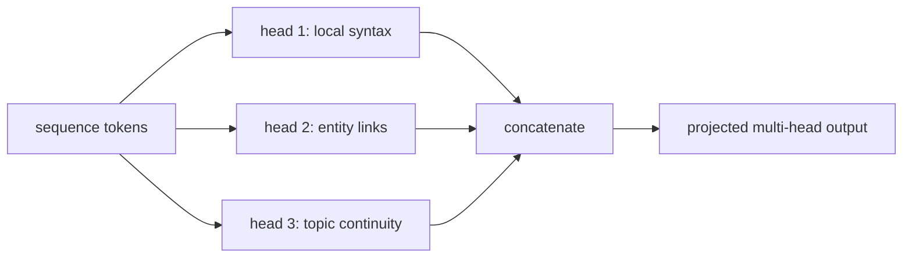

# Part 3: Attention, context, and the geometry of relevance

This chapter is the heart of the Transformer. The earlier pieces gave us tokens, embeddings, and position. Attention is the part that turns a static token into a context-dependent meaning.

**Foundation connection:** [Dot products, outer products, and softmax](module_01_foundations.md#foundation-linear-algebra) provide the numerical backbone. This chapter turns those primitives into the actual routing mechanism used in transformers.

## 1. Why static embeddings are not enough

A token like “bank” can mean a financial institution, the side of a river, or a place where a plane turns. The embedding lookup gives the same initial vector to the same token ID no matter what sentence it appears in.

That is useful, but it is not enough. A language model needs a representation that changes with the surrounding context.

The same is true for “mole,” “tower,” or “charge.” The meaning depends on nearby words, topic, and legal or scientific context. A single fixed embedding is just a starting point.

Attention solves this by letting each token ask:

- Which nearby tokens matter to me here?
- How strongly should I rely on each one?
- What information should be mixed into my current representation?

This is the step from a token identity to a context-aware meaning.

## 2. The geometric picture

Think of the embedding space as a semantic geometry. A token embedding is a point in a high-dimensional space, but the embedding alone does not contain the full sentence context.

The attention block computes a new representation by pulling information from relevant positions. The resulting vector moves in a different direction depending on the surrounding words.

So the role of attention is not to invent meaning from nowhere. It is to update a token’s representation using the evidence in the sequence.

That is why attention is often described as a learned routing mechanism: the model learns which context signals are relevant and how strongly to mix them.

A useful intuition is to think of attention as a content-based lookup system. A token asks a question, compares that question against all candidate tokens, and then retrieves the information from the most relevant ones. In a dictionary, you search for a word, find the matching entries, and read the corresponding definitions. In attention, the query plays the role of the search key, the keys act like indexes or labels, and the values are the actual content that gets retrieved.

This is the basic principle behind attention: instead of treating each token as isolated, the model lets one token “look up” the information it needs from the surrounding context. The matching is not hard-coded; it is learned by the model through the projection matrices and the training objective.

That is the bridge from the intuition to the formal Transformer notation: a token asks “which other tokens are relevant to me?” and then receives a weighted mixture of their value vectors.

## 3. Query, key, and value

After embedding, every token gets a vector $e_i$. The model then projects it into three different spaces:

$$
q_i = W^Q e_i,
\quad
k_i = W^K e_i,
\quad
v_i = W^V e_i
$$

These are the usual Transformer ingredients:

- $q_i$ is the query: “what information am I looking for?”
- $k_i$ is the key: “what information does this token carry?”
- $v_i$ is the value: “what content should be passed along if this token is relevant?”

The model learns the matrices $W^Q$, $W^K$, and $W^V$ from training data. They are not handcrafted features. They are learned projections that align token representations with useful comparison patterns.

The equations are simple, but the meaning is important. The same token is projected into three different roles, and the model learns which role is useful for which context. The query tells us where to look; the key tells us what each token offers; the value tells us what information is actually passed forward when a match is found.

## 4. Compare each token to all keys

For a token at position $i$, we compare its query against every key in the sequence by dot product:

$$
\alpha_{ij} = q_i \cdot k_j
$$

A large positive value means the two positions look relevant to each other under the current learned metric. A small or negative value means they are not strongly aligned.

If we stack all queries and keys into matrices $Q$ and $K$, then the full score matrix is:

$$
S = \frac{QK^\top}{\sqrt{d_k}}
$$

This is the matrix of all pairwise similarities. Each entry $S_{ij}$ measures how much query $i$ matches key $j$ after the learned projection. A larger value means “this token is a stronger candidate source for context.”

The scaling by $\sqrt{d_k}$ is a numerical stabilization trick. It keeps the score magnitudes from growing too large as the key dimension increases. Without this scaling, some heads can become overly sharp, and the attention pattern can collapse too aggressively during training.

This matrix is the heart of attention: it records pairwise relevance between every query position and every key position.

## 5. Softmax turns scores into weights

Raw dot products are not probabilities. We convert them into attention weights with softmax:

$$
A = \mathrm{softmax}(S),
\qquad
\mathrm{softmax}(z)_i = \frac{e^{z_i}}{\sum_j e^{z_j}}.
$$

This does two things at once:

1. it turns the raw similarity scores into positive values
2. it normalizes them so the row sums to 1

So each row of $A$ becomes a probability distribution over the context positions. The model is not picking a single token. It is saying: “here is how much I want to rely on each token in the context.”

A tiny example makes this concrete. Suppose the score row for one query is:

$$
[2.1,\ 1.7,\ 2.9,\ 0.6,\ 1.3,\ 0.2]
$$

Applying softmax gives something like:

$$
[0.10,\ 0.12,\ 0.38,\ 0.08,\ 0.25,\ 0.07].
$$

The token with the largest score, $2.9$, gets the largest weight, but the other scores are not discarded. They still contribute in smaller amounts. This is exactly why the attention pattern is soft rather than hard: the model learns a weighted mixture, not a single winner.

This is why the operation is called attention: the model pays more attention to some positions and less to others, while still retaining a broad context.

## 6. Values carry the information

Once the weights are known, the model mixes the value vectors:

$$
O_i = \sum_j A_{ij} v_j
$$

This is the actual information transfer step.

The process is:

1. compute how relevant each context token is
2. normalize that into attention weights
3. use those weights to combine value vectors
4. produce the updated representation for the current token

The weighting is the important idea. The attention pattern decides which context content enters the token state; the values are the content being passed along.

The output is then used in the layer update:

$$
h' = h + O
$$

This is the residual connection. The original hidden state $h$ is not thrown away. Instead, the attention result $O$ is added back to it, so the model keeps the original token information while also incorporating context. In a full Transformer block the usual pattern is:

$$
X \leftarrow X + \mathrm{MHA}(\mathrm{LN}(X))
$$

$$
X \leftarrow X + \mathrm{MLP}(\mathrm{LN}(X))
$$

This is why attention is a contextual refinement, not a replacement: the model keeps the token’s identity and adds the context-aware correction.

## 7. The canonical attention equation

The full attention layer is written as:

$$
\mathrm{Attention}(Q, K, V) = \mathrm{softmax}\left(\frac{QK^\top}{\sqrt{d_k}}\right)V
$$

Read this carefully in order:

1. compute the score matrix $QK^\top$
2. scale it to keep magnitudes stable
3. apply softmax row by row so each query gets a valid probability distribution
4. use those weights to mix the value vectors

The output is a weighted sum of values, so the model passes information from the context positions that were most relevant to the current token.

This is the core Transformer primitive.

<figure>
  
  <figcaption>Figure 2 from Vaswani et al., <a href="https://papers.neurips.cc/paper/7181-attention-is-all-you-need.pdf"><em>Attention Is All You Need</em></a> (2017). On the left, Q and K form scores, scaling and an optional mask are applied before softmax, and the weights mix V. On the right, several heads run in parallel, are concatenated, and pass through the output projection.</figcaption>
</figure>

It is mathematically simple, but the behavior is rich because the model learns $W^Q$, $W^K$, and $W^V$ from data. The same formula can learn different relationship patterns depending on the task, training objective, and layer depth.

## 8. A full worked example with exact dimensions

A real Transformer may have:

- vocabulary size $V \approx 50{,}000$
- embedding dimension $d = 128$
- one attention head with head dimension $d_k = d_v = 64$

This is far too large to draw exactly, so we show the shape and the logic with a small example and a sentence-level matrix view.

### 8.1 One token: $q$, $k$, and $v$ as vectors

Take the token “bank.” Its embedding is a vector:

$$
h_{\text{bank}} \in \mathbb{R}^{128}
$$

After positional encoding, it is still a $128$-dimensional vector:

$$
\tilde{h}_{\text{bank}} = h_{\text{bank}} + p_{\text{bank}} \in \mathbb{R}^{128}
$$

Now the model projects this single token into three different spaces:

$$
q_{\text{bank}} = W^Q \tilde{h}_{\text{bank}} \in \mathbb{R}^{64}
$$

$$
k_{\text{bank}} = W^K \tilde{h}_{\text{bank}} \in \mathbb{R}^{64}
$$

$$
v_{\text{bank}} = W^V \tilde{h}_{\text{bank}} \in \mathbb{R}^{64}
$$

with

$$
W^Q, W^K, W^V \in \mathbb{R}^{128 \times 64}.
$$

For the current word “bank,” the model compares its query against the keys of nearby words:

$$
q_{\text{bank}} \cdot k_j,
\qquad
j \in \{\text{the}, \text{bank}, \text{was}, \text{crowded}, \text{near}, \text{river}\}
$$

This gives a score vector:

$$
s_{\text{bank}} = \left[
q_{\text{bank}} \cdot k_{\text{the}},
q_{\text{bank}} \cdot k_{\text{bank}},
q_{\text{bank}} \cdot k_{\text{was}},
q_{\text{bank}} \cdot k_{\text{crowded}},
q_{\text{bank}} \cdot k_{\text{near}},
q_{\text{bank}} \cdot k_{\text{river}}
\right]
\in \mathbb{R}^{6}
$$

Then the model rescales and normalizes this score vector:

$$
\alpha_{\text{bank}} = \mathrm{softmax}\left(\frac{s_{\text{bank}}}{\sqrt{64}}\right) \in \mathbb{R}^{6}
$$

Suppose this gives:

$$
\alpha_{\text{bank}} = [0.10,\ 0.12,\ 0.38,\ 0.08,\ 0.25,\ 0.07]
$$

The updated representation for “bank” is then:

$$
O_{\text{bank}} = \sum_j \alpha_{\text{bank},j} v_j,
\qquad
O_{\text{bank}} \in \mathbb{R}^{64}
$$

This is the one-word worked example. At this point, the shapes are clear:

- token embedding: $128$
- query/key/value: $64$
- score vector against the sentence: $T$
- attention weight vector: $T$
- output vector: $64$

### 8.2 Full sentence: $X$, $Q$, $K$, $V$, $S$, $A$, $O$

Now take a sentence of length $T=6$. The token embeddings form a matrix:

$$
X =
\begin{bmatrix}
 e_{\text{the}} \\
 e_{\text{bank}} \\
 e_{\text{was}} \\
 e_{\text{crowded}} \\
 e_{\text{near}} \\
 e_{\text{river}}
\end{bmatrix}
\in \mathbb{R}^{6 \times 128}
$$

Add position:

$$
H = X + P,
\qquad
H \in \mathbb{R}^{6 \times 128}
$$

Project the whole sentence:

$$
Q = H W^Q \in \mathbb{R}^{6 \times 64}
$$

$$
K = H W^K \in \mathbb{R}^{6 \times 64}
$$

$$
V = H W^V \in \mathbb{R}^{6 \times 64}
$$

Then compute all pairwise similarities at once:

$$
S = \frac{QK^\top}{\sqrt{64}} \in \mathbb{R}^{6 \times 6}
$$

This matrix is the full attention score table. Each row is one query token, and each column is one key token.

Now apply row-wise softmax:

$$
A = \mathrm{softmax}(S) \in \mathbb{R}^{6 \times 6}
$$

Finally, mix values:

$$
O = AV \in \mathbb{R}^{6 \times 64}
$$

The row for the token “bank” is exactly the one-word computation in matrix form:

$$
O_{\text{bank},:} = \sum_j A_{\text{bank},j} v_j
$$

This is the exact end-to-end path:

$$
\text{sentence} \rightarrow X \rightarrow H = X + P \rightarrow Q, K, V \rightarrow S \rightarrow A \rightarrow O
$$

The one-word case is simply one row of the sentence-level computation. The full sentence is not different in principle; it is just the same operation applied to all tokens at once.

This is the real computational picture behind attention: the model does not view tokens independently. It turns the whole sequence into a set of query, key, and value matrices, builds a score grid, converts it to attention weights, and updates each token with a weighted mix of the relevant values.

The figure is intentionally simplified. A real transformer has $50{,}000$ vocabulary entries and $128$-dimensional vectors, but we only show a small set of words in a 3D projection so the geometry is visible.

- gray points: the base word embeddings
- red point: the current query for “bank”
- blue points: the context keys being compared against it
- gold point: the final attention output after weighting the values
- bars on the right: the softmax row that tells us how much each word contributes

This is the heart of attention: the model does not just look at a token’s identity. It updates that token using the context that best matches its current query.

## 9. Self-attention and cross-attention {#attention-routing-example}

A single consistent example helps here. Take the sentence:

> the bank was crowded near the river

and imagine the model is updating the word “bank.”

### Self-attention

In self-attention, the current token asks about other tokens in the same sequence. The same hidden state matrix supplies everything:

$$
Q = H W^Q,
\qquad
K = H W^K,
\qquad
V = H W^V
$$

where $H \in \mathbb{R}^{T \times d}$ is the hidden representation of the whole sentence. The query for “bank” is compared against all keys in the same sentence, and the values from the relevant positions are mixed back in.

This is the standard language-model setup. The model learns which nearby words matter for the current token, and it updates the representation based on that context.

### Cross-attention

In cross-attention, the math stays the same, but the sources change.

The decoder asks a question about the encoder output, not about its own previous tokens. A good worked example is machine translation:

- source English sentence: “The bank was crowded near the river.”
- target French sentence: “Le bord était bondé.”

Suppose the French decoder is generating the word for “bank” and needs to decide which English words matter. The decoder creates a query from its own representation:

$$
Q_{\text{dec}} = H_{\text{dec}} W^Q
$$

The encoder provides the keys and values for the source sentence:

$$
K_{\text{enc}} = H_{\text{enc}} W^K,
\qquad
V_{\text{enc}} = H_{\text{enc}} W^V
$$

Now the score matrix is:

$$
S = \frac{Q_{\text{dec}} K_{\text{enc}}^\top}{\sqrt{d_k}}
$$

followed by

$$
A = \mathrm{softmax}(S),
\qquad
O_{\text{dec}} = A V_{\text{enc}}.
$$

This is the crucial point for cross-attention: the decoder chooses where to look, but the encoder provides the keys and values that carry the content. The values do not come from nowhere; they are the transformed source-side hidden states from the encoder.

So the difference is not a different formula. The difference is which sequence provides the query and which sequence supplies the key/value content.

- self-attention: $Q, K, V$ all come from the same sentence
- cross-attention: $Q$ comes from the decoder, while $K$ and $V$ come from the encoder

In both cases, the final step is the same:

$$
h' = h + O
$$

The current token keeps its original representation, then receives a context-aware update.

### One consistent geometric picture

The same picture works for both settings:

- the current token asks a question with $Q$
- candidate tokens provide keys with $K$
- the selected content is delivered through $V$
- the model mixes the relevant values into a new, context-aware representation

This is what makes self-attention useful for language modeling and cross-attention useful for translation, summarization, and other conditioning tasks.

## 10. Why masked attention is required

For autoregressive generation, a token cannot attend to future tokens. Otherwise the model would look ahead and cheat during training.

This is handled with a causal mask.

For a sequence of length $T$, we define:

$$
M_{ij} =
\begin{cases}
0, & j \le i \\
-\infty, & j > i
\end{cases}
$$

Then the effective scores become:

$$
S_{ij} = \frac{q_i \cdot k_j}{\sqrt{d_k}} + M_{ij}
$$

After softmax, positions with $-\infty$ become zero weight. The token can only attend to the current prefix, never the future.

This is what makes next-token prediction possible while still allowing parallel training across positions.

### A causal-mask heatmap

The causal mask is easy to visualize as a matrix of allowed and forbidden connections.

The lower triangle is allowed; the upper triangle is blocked. This ensures each token only reads the prefix that is legally available at its position.

## 11. Why a single head is not enough

One attention head learns one relevance pattern. That is useful, but language contains many different kinds of relationships at once:

- pronoun to antecedent
- noun to adjective
- syntax to semantics
- local pattern to long-range context
- entity tracking across a sentence

A single head is usually too narrow to capture all of this. That is why transformers use multi-head attention.

## 12. Multi-head attention

Suppose there are $h$ heads and model width $d$. Each head uses its own learned projections:

$$
Q_h = XW_h^Q, \quad K_h = XW_h^K, \quad V_h = XW_h^V
$$

Then each head computes its own attention output:

$$
\mathrm{head}_h = \mathrm{Attention}(Q_h, K_h, V_h)
$$

The results are concatenated and projected back into the model width:

$$
\mathrm{MultiHead}(X) = \mathrm{Concat}(\mathrm{head}_1, \dots, \mathrm{head}_h)W^O
$$

This lets the model view the same sequence through multiple relational lenses at once. One head might emphasize syntax, another local similarity, another long-range topic continuity.

A useful mental picture is to imagine the same sentence being viewed under several filters at once:

- one head tracks local phrase structure
- one head tracks entity mentions
- one head tracks topic continuity
- one head tracks disagreement or sentiment edges

These are not hand-coded rules. They are learned patterns that emerge from the training objective.

Different heads do not all learn the same pattern. The same sentence is viewed under several learned filters, and each filter can specialize in a different relationship.

A simple schematic is:

The exact pattern is not a literal grammar; it is a learned attention structure. Multi-head attention is the model’s way of having several distinct relevance views at once.

The important point is not that each head is interpretable in a human sense. It is that multiple learned projections give the model more flexibility than a single attention pattern.

## 13. Why attention became the dominant idea

The transformer architecture replaced recurrence because it gave the model direct access to context without hiding everything inside a single compressed state.

In a recurrent model, information has to pass through a hidden state over time. In attention, each token can directly compare itself to any position in the sequence.

This makes long-range dependencies much easier to model. It also makes the architecture naturally parallelizable during training.

That is a major reason the transformer took over language modeling.

## 14. The computational cost

The naive self-attention score matrix has size $T \times T$ for a sequence of length $T$.

That makes the cost roughly:

$$
O(T^2 d)
$$

for sequence length $T$ and hidden width $d$. This is the famous quadratic cost of attention.

The issue is not just time. It is also memory. The model must store and read a large attention table and the corresponding key and value tensors.

This is one reason later systems research cares so much about efficient attention, caching, and sparse approximations.

## 15. The practical view in generation

At inference time, language models generate one token at a time.

Without optimization, each newly generated token would recompute attention against the full sequence again. That is wasteful because previous keys and values do not change.

The key-value cache stores previous key and value vectors so that only the newest token needs a full attention computation. This is the standard efficiency trick behind generation systems.

This is one of the places where the neat mathematical idea meets large-scale engineering.

## 16. The basic numeric recipe

The attention computation is simple when broken into steps:

1. compute query-key compatibility scores
2. convert them to a probability distribution with softmax
3. multiply by the value vectors
4. obtain the updated context-aware representation

This is the basic numeric recipe behind the whole layer. The visual examples above show what each step means in practice: scores tell us which positions are relevant, weights turn those scores into a distribution, and values carry the actual information that gets mixed into the output.

## 17. The central intuition to remember

If you remember only one idea from this chapter, remember this:

> Attention is a learned way to route information from the context into each token’s representation.

It is the place where a token stops being “just itself” and becomes a contextual state shaped by the sentence around it.

That is why attention sits at the center of the Transformer. It is not a small add-on. It is the mechanism that allows a model to build meaning from sequence structure.

The next chapter puts this mechanism into a full Transformer block with residual connections, layer normalization, and feed-forward layers.
