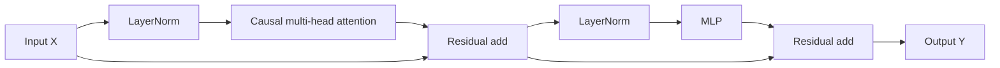
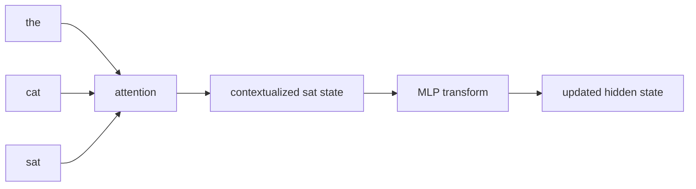

# Part 4: Build one decoder block

This chapter assembles the actual Transformer block that turns token states into context-aware hidden states. Up to now, we have seen the pieces separately: token lookup, position encoding, and attention. The decoder block is where they are combined in a trainable way.

**Foundation connection:** Review [matrix and batched shapes](module_01_foundations.md#foundation-linear-algebra), [residual gradient flow](module_01_foundations.md#foundation-backprop), and the [cost of a full score table](module_01_foundations.md#foundation-compute). This chapter is where the geometry and the algebra become one working block.

<figure>
  
  <figcaption>Figure 1 from Vaswani et al., <a href="https://papers.neurips.cc/paper/7181-attention-is-all-you-need.pdf"><em>Attention Is All You Need</em></a> (2017). This chapter implements a modern decoder-only descendant: retain masked self-attention and the feed-forward sublayer, remove the encoder and cross-attention, and use the pre-norm order stated below. The original figure itself uses post-norm.</figcaption>
</figure>

## 1. The block is a small pipeline

A decoder block is usually:

1. normalize the current token states
2. run causal multi-head self-attention
3. add a residual connection
4. normalize again
5. run a position-wise feed-forward network
6. add another residual connection

A simplified diagram is:



This is the standard pattern for a modern decoder block. The attention sublayer moves information between positions; the MLP sublayer transforms each position separately.

## 2. What a single block is doing

Think of the sequence as a batch of token states:

$$
X \in \mathbb{R}^{B \times T \times d}
$$

where:

- $B$ is batch size
- $T$ is sequence length
- $d$ is model width

Each attention head computes its own query, key, and value projections. If there are $h$ heads, each head has width $d_h = d/h$.

The key idea is that the same block is applied repeatedly. A single block does not “understand” the whole language. It refines the representation of each token by mixing in context and then projecting features through a learned nonlinear map.

The block does two kinds of work:

- cross-position mixing: attention
- per-position transformation: MLP

This is the basic design principle behind the Transformer.

## 3. Shape view of one decoder block

The common shape sequence is:

| Operation | Input shape | Output shape |
| --- | --- | --- |
| token embeddings + position | $(B,T)$ IDs | $(B,T,d)$ |
| projections into Q, K, V | $(B,T,d)$ | $(B,h,T,d_h)$ |
| score matrix | $Q,K$ | $(B,h,T,T)$ |
| attention output | scores + $V$ | $(B,h,T,d_h)$ |
| concat heads + projection | $(B,h,T,d_h)$ | $(B,T,d)$ |
| residual add | $X$, attention output | $(B,T,d)$ |
| MLP | $(B,T,d)$ | $(B,T,d)$ |

This is the practical shape story behind the math. The token sequence has width $d$, and each head splits that width into smaller learned subspaces. The score matrix has one row per query position and one column per key position, so the model can compare every token to every earlier token in a batch of sequences.

The mask is applied to the scores before softmax. Future positions are set to a very negative value so the resulting attention weights are effectively zero. This is why the model cannot see future tokens during autoregressive generation.

## 4. A tiny sentence through one block

Imagine the prefix:

> the cat sat

At the first layer, each token has a starting vector. The attention sublayer updates the representation of “sat” using evidence from “the” and “cat.” The MLP then transforms that updated vector within the same position.

This is a simple geometric story:

- “the” contributes lexical support
- “cat” contributes subject knowledge
- “sat” is the current token being contextualized
- attention decides how much each neighboring state matters
- the MLP reshapes the result in a non-linear way



The point is not that we can literally read off each learned weight. The point is that the block is doing two jobs: context routing and per-position feature transformation.

## 5. That residual path matters

Residual connections are not cosmetic. Without them, the model would be trying to learn a complicated transformation from scratch at every layer.

The standard pre-norm form is:

$$
H = X + \mathrm{MHA}(\mathrm{Norm}(X))
$$

and then

$$
Y = H + \mathrm{MLP}(\mathrm{Norm}(H))
$$

The first equation says: keep the original state $X$, then add the learned attention correction. The second says: keep the updated state $H$, then add the learned feed-forward correction. In other words, each block is not replacing the representation; it is refining it.

This means the block mostly preserves the original representation and adds a learned correction. That makes optimization much easier, especially in deep stacks.

The practical effect is that the model can stack many layers without destroying the token signal too early. Each layer adds a small improvement rather than replacing the previous state entirely.

## 6. MLP: same position, different feature view

The attention sublayer mixes tokens across positions. The MLP does not mix positions directly. It acts independently at each position:

$$
\mathrm{FFN}(x) = \phi(xW_1 + b_1)W_2 + b_2
$$

with a nonlinearity such as ReLU or GELU.

This is the feature transform step. It allows the network to apply a learned nonlinear operation to each token’s representation after the context has been assembled.

A useful intuition is:

- attention = “which context matters?”
- MLP = “how should this token state be transformed once it has that context?”

## 7. Why parameter counting matters

A rough parameter estimate helps explain why deep language models are expensive.

If the width is $d$ and the feed-forward hidden size is $d_{ff}$, then roughly:

- attention has about $4d^2$ parameters for Q, K, V, and output projections
- the MLP has about $2dd_{ff}$ parameters
- residual and normalization layers add some smaller overhead

With a common choice $d_{ff} \approx 4d$, the block is dominated by large linear projections. This is one reason training and inference cost grow quickly as width increases.

## 8. Tiny NumPy sketch of one block

```python
import numpy as np

# One tiny toy decoder block in a very simplified form.
# We do not implement the full Transformer; we only show the block idea.

x = np.array([[1.0, 0.5], [0.3, 0.9]])
W_q = np.array([[1.2, 0.1], [0.4, 0.7]])
W_k = np.array([[0.8, 0.2], [0.5, 0.9]])
W_v = np.array([[0.6, 0.4], [0.3, 1.0]])
W_o = np.array([[1.1, -0.2], [0.5, 0.8]])

Q = x @ W_q
K = x @ W_k
V = x @ W_v
scores = (Q @ K.T) / np.sqrt(K.shape[1])
mask = np.tril(np.ones_like(scores))
scores = np.where(mask == 1, scores, -1e9)
weights = np.exp(scores - scores.max(axis=-1, keepdims=True))
weights = weights / weights.sum(axis=-1, keepdims=True)
out = weights @ V
out = out @ W_o
print("Q shape:", Q.shape)
print("score matrix:\n", np.round(scores, 2))
print("attention output:\n", np.round(out, 2))
```

This is not a full production block, but it captures the exact structure:

- project to Q, K, V
- compute pairwise relevance
- apply causal mask
- softmax the row
- mix values
- project the result back

## 9. Why repeated blocks matter

One block is useful, but a model is usually a stack of many blocks. Each layer can refine the representation gradually.

The stages are:

- early layers capture local patterns and simple relations
- middle layers mix broader context and syntax
- deeper layers build more abstract, task-relevant features

The transformer is not a magic single-step solver. It is a stack of repeated transformations, each improving the state representation a little more.

## 10. The key takeaway

A decoder block is a small computational unit with a clear purpose:

- attention gathers relevant context
- residuals preserve useful information
- MLP transforms each position’s features
- repeated blocks build richer representations

This is the core of the transformer architecture. Everything else—training, inference, scaling, and generation—is built on top of this block.

## 11. Assemble Parts 1–3 without skipping a tensor

The earlier chapters supply the input to this block:

1. [Tokenization and embeddings](part_01_embeddings.md) turn integer IDs of shape $(B,T)$ into token vectors $E[\text{ids}]$ of shape $(B,T,d)$.
2. [Position](part_02_position_encoding.md) either adds a position vector to those token vectors or, with RoPE, later rotates query and key pairs inside attention.
3. [Attention](part_03_attention.md) projects the current states into $Q$, $K$, and $V$, applies the causal mask, and returns one context update per token.
4. This chapter adds normalization, residual paths, the output projection, and the MLP so the result can be stacked safely.

For a decoder-only model with additive position encoding, the path into the first block is

$$
X_0=E[\text{ids}]+P[0:T].
$$

With RoPE, there is normally no $P$ added here. Instead, each block creates $Q$ and $K$ and rotates their feature pairs before computing $QK^\top$. That difference belongs in the attention implementation; the rest of the block can keep the same input and output shape.

```mermaid
flowchart LR
    IDs[IDs B,T] --> E[Embedding lookup B,T,d]
    E --> P[Add position, or defer RoPE]
    P --> N1[Norm]
    N1 --> QKV[Q K V projections]
    QKV --> CA[Causal multi-head attention]
    CA --> WO[Output projection]
    P --> Add1[Residual add]
    WO --> Add1
    Add1 --> N2[Norm]
    N2 --> FF[Expand, activate, contract]
    Add1 --> Add2[Residual add]
    FF --> Add2
    Add2 --> Y[Next block B,T,d]
```



The residual stream always has width $d$. Internal tensors may use $h$ heads, head width $d_h$, or MLP width $d_{ff}$, but every sublayer must return to $d$ before it can be added to the residual stream.

## 12. Multi-head attention inside the block, operation by operation

Begin with normalized states $N\in\mathbb R^{B\times T\times d}$. The four attention matrices are

$$
W_Q,W_K,W_V,W_O\in\mathbb R^{d\times d}.
$$

The combined projections have shape $(B,T,d)$:

$$
Q=NW_Q,\qquad K=NW_K,\qquad V=NW_V.
$$

Reshape each to $(B,T,h,d_h)$ and transpose to $(B,h,T,d_h)$, where $d=h d_h$. No information is created by this reshape; it only groups features into heads. For every batch item and head:

$$
S=\frac{QK^\top}{\sqrt{d_h}}\in\mathbb R^{T\times T},
$$

$$
A=\operatorname{softmax}(S+M),\qquad O_{heads}=AV.
$$

$M_{ij}=0$ when key $j$ is visible to query $i$ and $M_{ij}=-\infty$ when it is forbidden. After concatenating the heads back to $(B,T,d)$, the output projection gives

$$
O=\operatorname{Concat}(O_1,\ldots,O_h)W_O.
$$

$W_O$ matters because concatenation alone leaves every head in a fixed slice of the feature vector. The projection lets the block learn combinations of features contributed by different heads and returns an update in the residual-stream coordinates.

### Causality test, not just a mask picture

A causal implementation must satisfy this property: changing token position $j$ cannot change any output at positions $i<j$. A useful test is to run the same block twice, change only the last input token, and assert that all earlier outputs are identical. The repository test suite performs exactly this check for the NumPy block.

## 13. Layer normalization from the equation to code

For one token vector $x\in\mathbb R^d$, LayerNorm computes statistics across its **feature** axis:

$$
\mu=\frac1d\sum_{r=1}^{d}x_r,
\qquad
\sigma^2=\frac1d\sum_{r=1}^{d}(x_r-\mu)^2,
$$

$$
\operatorname{LN}(x)=\gamma\odot
\frac{x-\mu}{\sqrt{\sigma^2+\epsilon}}+\beta.
$$

$\gamma$ and $\beta$ are learned vectors of length $d$. The operation does not average across tokens, so normalization at one position cannot leak information from a future position. For a tensor $(B,T,d)$, code therefore uses `axis=-1` and keeps that axis for broadcasting:

```python
mean = x.mean(axis=-1, keepdims=True)
variance = ((x - mean) ** 2).mean(axis=-1, keepdims=True)
x_hat = (x - mean) / np.sqrt(variance + eps)
y = gamma * x_hat + beta
```

The $\epsilon$ protects division when feature variance is extremely small. LayerNorm and attention softmax have different jobs: LayerNorm controls feature scale within a token; softmax normalizes routing scores across key positions.

### Pre-norm and post-norm are different computation graphs

The original research figure is post-norm:

$$
H=\operatorname{LN}(X+\operatorname{MHA}(X)),
\qquad
Y=\operatorname{LN}(H+\operatorname{MLP}(H)).
$$

The block implemented in this repository is pre-norm:

$$
H=X+\operatorname{MHA}(\operatorname{LN}(X)),
\qquad
Y=H+\operatorname{MLP}(\operatorname{LN}(H)).
$$

Do not mix the two by moving only one normalization. Pre-norm leaves a particularly direct residual path through a deep stack. The final language model commonly adds one more normalization after the last block and before the vocabulary projection.

## 14. The MLP is a learned feature expansion

At every position, the same two matrices implement

$$
u=xW_1+b_1,\qquad a=\operatorname{GELU}(u),\qquad y=aW_2+b_2,
$$

with

$$
W_1\in\mathbb R^{d\times d_{ff}},qquad
W_2\in\mathbb R^{d_{ff}\times d}.
$$

If $d_{ff}=4d$, the first projection expands every token into four times as many intermediate features. The nonlinearity is essential: two linear maps without an activation collapse into a single linear map, $xW_1W_2$. GELU gates the expanded features smoothly, and $W_2$ combines them into a width-$d$ residual update.

Because the same MLP is independently applied at each token position, it can be implemented as matrix multiplication over the final axis of the whole $(B,T,d)$ tensor. There is no Python loop over tokens and no $T\times T$ interaction in this sublayer.

Modern architectures may replace this with a gated MLP such as SwiGLU. That changes the feature transform and parameter count, but it does not change the division of labor: attention mixes positions; the MLP mixes features within each position.

## 15. A complete NumPy forward pass

The repository now contains a runnable implementation in `llm_foundations/decoder_block.py` with four deliberately separate pieces:

- `LayerNorm`: feature-axis normalization with learned scale and shift
- `MultiHeadAttention`: Q, K, V projections, head split/combine, causal attention, and $W_O$
- `MLP`: expansion, GELU, and contraction
- `DecoderBlock`: the two pre-norm residual updates

Use it locally from the repository root:

```python
import numpy as np

from llm_foundations.decoder_block import DecoderBlock

rng = np.random.default_rng(7)
x = rng.normal(size=(2, 5, 8))       # B=2, T=5, d=8
block = DecoderBlock(
    d_model=8,
    num_heads=2,
    d_ff=32,
    seed=7,
)
y = block(x)

print("input: ", x.shape)
print("output:", y.shape)
assert y.shape == x.shape
```

The implementation omits dropout so repeated runs are easy to inspect. It is a forward-pass teaching implementation, not an optimized training kernel. NumPy materializes attention tensors and does not provide automatic differentiation here. The [training chapter](part_05_training_and_optimization.md) explains how a loss and backpropagation turn this forward graph into a trainable model.

## 16. From one block to vocabulary logits

One decoder block does not itself predict a token. A small language model wraps the stack:

$$
\text{IDs}
\rightarrow X_0
\rightarrow \operatorname{Block}_1
\rightarrow\cdots\rightarrow
\operatorname{Block}_L
\rightarrow \operatorname{Norm}
\rightarrow \text{logits}.
$$

If the last hidden tensor is $H\in\mathbb R^{B\times T\times d}$ and the output matrix is $W_U\in\mathbb R^{d\times V}$, then

$$
Z=HW_U+b_U\in\mathbb R^{B\times T\times V}.
$$

During training, every position's row of $V$ logits is compared with the next token target. During generation, the model uses the logits at the newest position to choose one token, appends it, and runs the next step. The block always transforms hidden states; the vocabulary projection is the bridge back to token IDs.

## 17. Worked parameter count

For $d=512$, $h=8$, and $d_{ff}=2048$:

| Component | Weights | Biases | Count |
| --- | ---: | ---: | ---: |
| Q, K, V, output projections | $4(512^2)$ | $4(512)$ | $1,050,624$ |
| MLP expansion and contraction | $2(512)(2048)$ | $2048+512$ | $2,099,712$ |
| Two LayerNorms | two scales | two shifts | $2,048$ |
| **Total block** |  |  | **$3,152,384$** |

The head count does not multiply the $4d^2$ projection count when Q, K, and V are stored as combined $d\times d$ matrices. More heads split the same projected width into smaller pieces. Architectures with grouped-query attention, gated MLPs, projection biases removed, or different normalization have different totals, so count the code being used rather than memorizing one formula.

## 18. Implementation checklist and failure modes

Before stacking blocks, verify one block:

1. `d_model % num_heads == 0`.
2. Q, K, and V become $(B,h,T,d_h)$ before score multiplication.
3. Softmax runs across the key axis, the final axis of $(B,h,T,T)$.
4. The causal mask is applied before softmax and permits the diagonal.
5. Concatenated heads return to $(B,T,d)$ before $W_O$.
6. Both residual additions combine tensors with exactly the same shape.
7. LayerNorm uses the feature axis rather than batch or time.
8. Changing a future token leaves earlier outputs unchanged.
9. All attention rows are finite and sum to one before value mixing.
10. The hand parameter count matches the arrays created by code.

Common bugs include transposing the wrong axes, normalizing score columns instead of rows, applying a mask after softmax, forgetting the output projection, and accidentally broadcasting a residual across the time axis. Printing every intermediate shape is more useful than staring at the final output after one of these mistakes.

## 19. Coding milestones

Build the block in this order:

1. Implement and test stable softmax and a lower-triangular Boolean mask.
2. Implement one causal attention head and verify its weight rows.
3. Add split-head and combine-head functions; test that combining reverses splitting.
4. Add $W_O$ and confirm attention returns width $d$.
5. Implement LayerNorm and confirm each token has approximately zero mean and unit variance before learned scale and shift.
6. Implement the MLP and confirm that it preserves $(B,T,d)$ externally.
7. Add the two residual paths.
8. Run the future-token causality test.
9. Stack two blocks and add final normalization and vocabulary projection.
10. Connect shifted targets and cross-entropy from Part 5, then overfit one tiny batch.

Completing those milestones means you can trace and code the full decoder-block forward path from the equations, understand every tensor shape, and identify where training must supply gradients.
