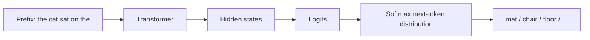
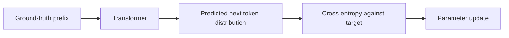
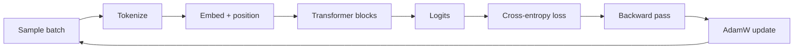

# Part 5: Training objective, teacher forcing, and optimization

This chapter explains the learning signal behind the transformer. The architecture defines the mechanism; training is what turns that mechanism into a useful model.

**Foundation connection:** The [sequence chain rule](module_01_foundations.md#foundation-probability) defines the prediction task; [cross-entropy and perplexity](module_01_foundations.md#foundation-loss) define the measurement; [backpropagation](module_01_foundations.md#foundation-backprop) and [validation](module_01_foundations.md#foundation-learning) explain updates and checks. This chapter connects those ideas into a full training loop.

## 1. The real objective: next-token prediction

A decoder-only model is trained to model:

$$
P(x_{t+1} \mid x_1, \dots, x_t)
$$

This says: given the current prefix, what is the most likely next token?

The conditioning is the whole point. The model sees all previous tokens and asks for a distribution over the next symbol. The output is not a single guessed word; it is a probability vector over the whole vocabulary. This is why the training objective is often described as next-token prediction.

The model is not trying to “understand language” in a mystical way. It is learning a distribution over possible continuations so that the correct token gets the highest probability.

For a small example, consider the prefix:

> the cat sat on the

A model should assign much higher probability to words like “mat,” “chair,” or “floor” than to random tokens like “planet” or “bicycle.”



This is the whole training objective in one picture: map a prefix to a distribution over the vocabulary.

## 2. A toy softmax example

Suppose the model produces the logits:

$$
[2.0,\ 1.0,\ 0.2]
$$

for three candidate next tokens: “mat,” “chair,” and “floor.”

After softmax:

$$
P = \mathrm{softmax}(z) = \frac{e^z}{\sum_j e^{z_j}}
$$

The logits $z$ are raw unnormalized scores. Softmax converts them into a valid probability distribution by exponentiating each score and dividing by the total mass. Larger logits become larger probabilities, but the conversion also ensures the outputs are positive and sum to one.

The resulting probabilities are roughly:

- “mat”: 0.62
- “chair”: 0.30
- “floor”: 0.08

A toy Python version is:

```python
import numpy as np

logits = np.array([2.0, 1.0, 0.2])
probs = np.exp(logits - logits.max())
probs = probs / probs.sum()
print(np.round(probs, 3))
```

This is the same kind of distribution that an LLM produces for a real vocabulary of tens of thousands of tokens.

## 3. Cross-entropy is the training signal

The target token for that prefix is the correct next token. Training compares the predicted distribution to the target distribution using cross-entropy.

For a single example, the loss is

$$
\mathcal{L} = -\log P(y_{\text{true}} \mid x)
$$

This says: take the probability assigned to the correct next token, take its log, and negate it. If the model assigns high probability to the correct token, the log term is close to zero and the loss is small. If the model is confident but wrong, the probability is tiny and the loss is large.

This is the exact training signal: the model is rewarded when it gives high probability to the true next token and punished when it does not.

A tiny numerical example makes it concrete:

```python
import numpy as np

logits = np.array([2.0, 1.0, 0.2])
probs = np.exp(logits - logits.max())
probs = probs / probs.sum()
true_index = 0
loss = -np.log(probs[true_index])
print("probabilities:", np.round(probs, 3))
print("loss:", round(loss, 3))
```

This is the exact mechanism behind large-model training. The loss is computed at the output layer and then backpropagated through the entire stack.

## 4. Teacher forcing makes training practical

Teacher forcing means the model is given the true prefix during training instead of its own generated text.

For the sentence:

> the cat sat on the

the model is trained to predict the next token from the correct prefix, not from a prefix made of its own earlier mistakes.

This is powerful because it allows the training loss to be computed for every position in the sentence in parallel.



This is why pretraining is efficient. The model sees a full sequence and learns a prediction target at every valid position.

## 5. Why teacher forcing is different from generation

At inference time, the model does not know the future. It must generate the next token from its own previous outputs.

So training and inference are different:

- training: true prefix
- inference: generated prefix

This creates the usual mismatch between supervised learning and generation. That is why decoding choices such as greedy selection, temperature, top-k, and nucleus sampling matter so much.

The model learns a distribution; decoding turns that distribution into an actual text path.

## 6. Backpropagation through the stack

Once the loss is computed, gradients flow backward through the full model:

- output projection
- final normalization
- transformer blocks
- attention layers
- MLP layers
- embeddings and position encodings

The architecture provides a structure for computation. The gradient tells each parameter how to change in order to reduce the loss.

This is where the model learns which token relationships matter, which context patterns are useful, and which parts of the representation space are worth preserving.

## 7. Optimizer: AdamW and the update step

The most common optimizer is AdamW. It combines:

- momentum-like first moments
- adaptive second moments
- weight decay for regularization

The simple update form is:

$$
\theta \leftarrow \theta - \eta \cdot \frac{\hat{m}_t}{\sqrt{\hat{v}_t} + \epsilon}
$$

where $\eta$ is the learning rate and $\hat{m}_t, \hat{v}_t$ are gradient statistics.

This formula says: estimate a direction of descent from the gradient, normalize it using a running estimate of its scale, and then take a step in that direction. The first moment $\hat{m}_t$ captures the average direction; the second moment $\hat{v}_t$ captures how large the gradient has been. AdamW is therefore adaptive: large gradients can be damped, small gradients can be given a larger effective step, and weight decay discourages parameters from growing without benefit.

The main practical idea is that the optimizer adapts step sizes per parameter so that updates are not all the same size.

This matters because the transformer has many millions or billions of parameters, and gradients can vary a lot across layers and directions.

## 8. A tiny training step

```python
import numpy as np

# A toy one-parameter model: output = theta * x
x = 2.0
target = 5.0
theta = 1.0
learning_rate = 0.1

loss = (theta * x - target) ** 2
gradient = 2 * x * (theta * x - target)
theta = theta - learning_rate * gradient

print("loss:", loss)
print("updated theta:", theta)
```

The real transformer has far more parameters than this, but the learning principle is the same: compute a loss, compute a gradient, and step the parameters in the direction that reduces the loss.

## 9. Why the task is so powerful

Next-token prediction is simple to state but hard to do well. A model must represent:

- syntax
- semantics
- entity tracking
- discourse structure
- long-range dependency
- world knowledge

The objective is strong enough that the model learns all of these indirectly from the raw data. That is why language modeling works so well as a pretraining task.

## 10. Pretraining and later stages

Pretraining is the first part of the pipeline. The model learns general language structure from large corpora.

After that, systems often add:

- supervised fine-tuning
- instruction tuning
- preference optimization
- reinforcement learning loops

These later stages shape the model’s behavior, but they sit on top of the same underlying next-token objective.

## 11. Training loop in one picture



This is the heartbeat of LLM training: repeated batches, repeated losses, repeated parameter updates.

## 12. Key takeaway

The architecture gives the model a way to represent and route information. Training gives it the objective that makes those parameters meaningful.

The central idea is simple:

> a model gets better by making the correct next token more probable and the wrong ones less probable.

That is why the transformer learns such strong language structure from a relatively simple next-token target.
