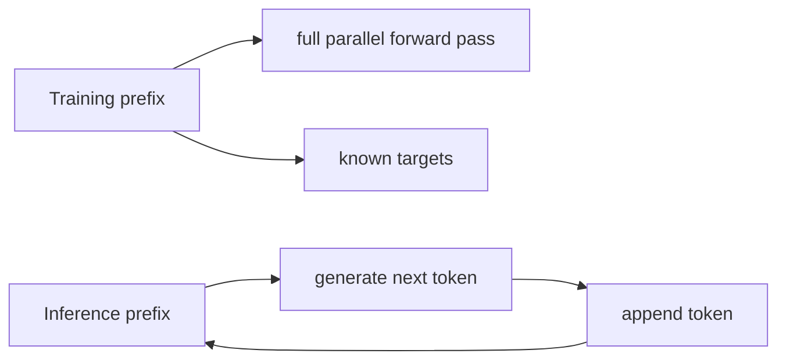

# Part 6: Inference, scaling, and generation tricks

This chapter is about what happens after training. A model has learned a next-token distribution; inference is the process of turning that distribution into coherent generated text while keeping cost under control.

**Foundation connection:** [Conditional sequence probability](module_01_foundations.md#foundation-probability) explains token-by-token generation; [softmax temperature](module_01_foundations.md#foundation-softmax) explains tuning the distribution; [attention cost](module_01_foundations.md#foundation-compute) motivates caching and memory-aware kernels. The examples here show what those ideas look like at runtime.

## 1. Training and inference are different

During training, the sequence is known and the model can compute the loss for every token in parallel.

At inference time, the model must generate one token at a time:

$$
\hat{x}_{t+1} \sim P(\cdot \mid \hat{x}_1, \ldots, \hat{x}_t)
$$

This is the same conditional distribution, but now the prefix is generated by the model itself. There is no ground truth to guide the next step. The model must sample from its own predicted distribution, append the chosen token, and repeat. This is the autoregressive loop that turns a learned next-token model into generated text.



This is why generation is sequential even though the model was trained with parallel blocks.

## 2. A small generation loop

Suppose the prompt is:

> the cat sat on the

The model computes a distribution over the next word. If the top token is “mat,” it appends it, re-runs the model, and continues. This is autoregressive generation.

A tiny toy distribution could look like this:

- “mat”: 0.42
- “chair”: 0.25
- “floor”: 0.18
- “bench”: 0.10
- “rope”: 0.05

The model chooses according to a decoding policy. Greedy decoding picks “mat”; sampling may choose “chair” or “floor” depending on randomness and temperature.

## 3. Greedy decoding versus sampling

Greedy decode is simple:

$$
\hat{x}_{t+1} = \arg\max_v P(v \mid x_{1:t})
$$

Sampling instead picks from the distribution:

$$
\hat{x}_{t+1} \sim P(\cdot \mid x_{1:t})
$$

The difference is important. Greedy decoding is deterministic and often repetitive. Sampling gives more diversity but can drift into less coherent text.

```python
import numpy as np

probs = np.array([0.42, 0.25, 0.18, 0.10, 0.05])
choices = ["mat", "chair", "floor", "bench", "rope"]

# greedy
print("greedy:", choices[np.argmax(probs)])

# sample one token
rng = np.random.default_rng(0)
print("sampled:", choices[rng.choice(len(choices), p=probs)])
```

Temperature is another knob. A higher temperature flattens the distribution and increases randomness; a lower temperature sharpens it and moves the sample closer to the argmax.

## 4. Temperature and the shape of the distribution

Temperature modifies the logits before softmax:

$$
P_i = \frac{\exp(z_i/T)}{\sum_j \exp(z_j/T)}
$$

where $T$ is the temperature.

This means the model is not changing the relative ordering of the logits; it is changing how strongly that ordering is emphasized. A small temperature $T<1$ makes the differences between logits larger, so one token dominates the distribution. A large temperature $T>1$ compresses the differences and spreads probability mass more evenly across candidates.

- small $T$: sharper distribution, more deterministic output
- large $T$: flatter distribution, more creative but less stable behavior

The effect is easiest to see in a plot. A sharp distribution means the model is confident about one next token; a flat distribution means the model is uncertain and more willing to explore alternatives.

```python
import numpy as np
import matplotlib.pyplot as plt

logits = np.array([3.0, 2.0, 1.0, 0.0])
for temp in [0.5, 1.0, 2.0]:
    probs = np.exp(np.array(logits) / temp)
    probs = probs / probs.sum()
    plt.bar([f"t{idx}" for idx in range(len(probs))], probs, alpha=0.7, label=f"T={temp}")

plt.title("Effect of temperature on next-token probabilities")
plt.ylabel("probability")
plt.legend()
plt.tight_layout()
plt.show()
```

This is why temperature is one of the main controls in generation systems.

## 5. Causal attention and autoregressive structure

A decoder-only model cannot look at future tokens. That is why the attention mask is causal.

At token $i$, the model is allowed to attend to positions:

$$
1, 2, \dots, i
$$

but not to positions beyond $i$.

This makes generation possible while preserving the ability to train in parallel. The model sees the prefix, not the future.

The practical consequence is simple: each generated token depends on the entire prefix, and each new token grows the context window by one.

## 6. Why the KV cache matters

Naive autoregressive generation recomputes attention against the whole prefix at every step. That wastes work because old keys and values are unchanged.

The solution is the key-value cache.

At each step:

- compute the newest query, key, and value
- append them to the cache
- reuse cached prefix keys and values for the next computation

This turns generation from “recompute everything” into “compute the new token and reuse the past.”

```python
import numpy as np

class KVCache:
    def __init__(self, max_len):
        self.max_len = max_len
        self.keys = []
        self.values = []

    def append(self, k, v):
        self.keys.append(k)
        self.values.append(v)
        if len(self.keys) > self.max_len:
            self.keys.pop(0)
            self.values.pop(0)

cache = KVCache(4)
for step in [(1.0, 2.0), (2.0, 3.0), (3.0, 4.0)]:
    cache.append(np.array(step[0:2]), np.array(step[1:3]))
    print("cached prefix length:", len(cache.keys))
```

This is the core engineering trick behind practical decoding. It matters because generation is sequential and context lengths can be large.

## 7. Attention cost and the real bottleneck

The naive attention matrix has size $n \times n$ for a sequence of length $n$.

This gives a cost roughly like:

$$
O(n^2 d)
$$

The reason this grows quadratically is simple: every query position compares itself against every key position, so the number of pairwise interactions scales with $n^2$. In a long context, that becomes expensive in both time and memory. This is why inference systems care so much about caching, block-wise reductions, and efficient implementations.

The problem is not only time. It is also memory traffic. Large key and value tensors are repeatedly re-read during generation.

That is why practical systems care about:

- KV cache layout
- memory-efficient kernels
- block-wise attention
- longer context support

The math is still the same. The challenge is making it usable in a real deployment.

## 8. FlashAttention and memory-aware compute

FlashAttention is a better way to execute the attention operation on modern hardware.

The idea is to avoid materializing the huge score matrix in slow memory and instead compute attention in a more hardware-friendly pattern.

This matters because transformer attention is often not compute-bound; it is memory-bound. If the operation forces too much memory traffic, the model slows down even if the arithmetic is simple.

That is why more efficient implementations matter so much in long-context workloads.

## 9. Speculative decoding and faster generation

A strong practical optimization is speculative decoding.

The idea is:

- a small model quickly proposes several likely next tokens
- a larger model verifies them in one pass
- accepted tokens are kept, reducing expensive full decoding steps

This is useful when the expensive model is accurate but slow. It is a classic example of engineering on top of the same math.

Simple intuition:

- the small model is fast but rough
- the large model is accurate but expensive
- verify a block of candidates instead of one token at a time

## 10. Inference-time scaling

Another modern theme is inference-time scaling. Instead of only increasing model size or training compute, systems may spend more compute while generating.

Examples include:

- repeated sampling and selection
- verification loops
- tree search for candidate reasoning paths
- more deliberate decoding for hard questions

This treats inference as a resource that can be spent deliberately. The model is not always using the shortest path. It uses more compute when the task is harder.

This is a key idea in current LLM research: quality can depend on how much reasoning compute is allocated at test time.

## 11. The generation stack in one sentence

A trained transformer turns text into a probability distribution, and inference turns that distribution into a sequence through decoding, caching, and systems-level optimization.

## 12. Final picture

The full generation pipeline is:

- prompt tokenization
- embedding + position
- repeated transformer blocks
- final logits
- softmax distribution
- decoding policy
- token append
- repeated steps with KV cache

This is the path from model to output text.

The important lesson is that the architecture and the runtime systems are both essential. The transformer provides the structure; inference tricks make the structure usable at scale.

## 14. Key takeaway

Inference tricks are not side notes. They are the engineering layer that makes the transformer usable for real generation.

The core model is still built around embeddings, position, and attention, but practical systems are shaped by latency, memory bandwidth, context length, and compute allocation at inference time.
